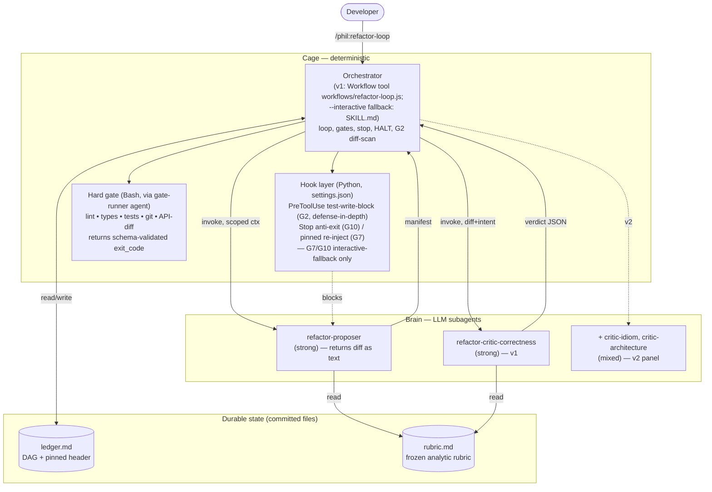
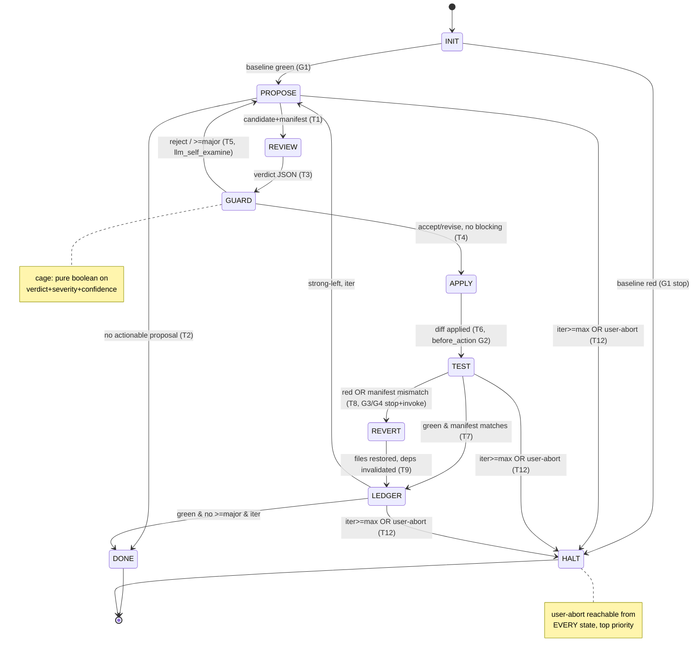

# phil:refactor-loop — Architecture

*Status: DRAFT (filling progressively). Architect: Morgan (nw-solution-architect),
interaction_mode = propose, scope = application/components.*

This document specifies the architecture for a **Claude Code skill + subagent system**:
the gated, closed-loop evolution of the existing `phil:review-code` + `phil:refactor`
pair. Deliverables are skills + subagents + hooks + a frozen rubric + a backlog ledger —
**not application code**. Construction goes through `nw:forge` (the 5-phase agent
builder), so this document outputs **specifications**, not implementation.

Every non-obvious choice traces to `rgr-loop.md` (the grounded design) or the gap memo
`docs/research/refactor-loop/rgr-loop-gap-analysis.md` (cited as gap-memo §summary-name).

> **Hard constraints honored** (from the design brief, non-negotiable):
> 1. `/phil:refactor` is untouched; `/phil:refactor-loop` is a SEPARATE new skill.
> 2. Deliverables = specs (skills/subagents/hooks/rubric), built via `nw:forge`.
> 3. Cage/brain seam: deterministic control flow in the orchestrator skill (real Bash +
>    hooks); LLM judgment in scoped subagents.
> 4. Three safety invariants (external-suite gate; proposer-can't-edit-tests;
>    compaction-immune pinned constraints + always-reachable HALT).
> 5. Two-stage substrate: lean skill-loop v1 first, Workflow-tool v2 for the panel.

---

## 0. Reading guide / section index

1. Orchestrator state machine (cage vs brain per transition; guard fire-points)
2. Subagent specs (proposer + critics; tools, model tier, I/O contracts)
3. Guard / hook set (four-outcome taxonomy; leverage law)
4. Backlog-as-DAG ledger (format; auto-invalidation of dependents)
5. Frozen rubric structure (analytic criteria; anti-flattery; CANNOT_ASSESS)
6. Convergence-proof acceptance checklist (no-op baseline; critic self-test; CIs)
7. The v1 ↔ v2 seam (what migrates; the trigger)
8. C4 Container + Component diagrams (Mermaid)
9. ADR index
10. Open design decisions for nw:forge

---

## 1. Orchestrator state machine

The orchestrator is the **cage**. It owns control flow as real Bash + hooks; it never
delegates the gate decision to an LLM. Subagents (the **brain**) are invoked only at two
states (`PROPOSE`, `REVIEW`) and produce typed output the cage routes on. This is the
load-bearing cut from `rgr-loop.md` §"the seam": *computational checks are sound, LLM
checks are advisory; never let advisory do a sound job, never let the model decide it's
done.*

### 1.1 States

| State | Owner | What happens |
|---|---|---|
| `INIT` | cage | Detect test runner, run **baseline suite** (must be green), snapshot pinned constraints, load DAG ledger, set `iter = 0`. |
| `PROPOSE` | brain | `refactor-proposer` subagent emits next candidate refactor + **predicted-impact manifest**. One refactor, not a batch. |
| `REVIEW` | brain | `refactor-critic-correctness` (v1) / disjoint panel (v2) emits **span+evidence verdict JSON**. Proposer's reasoning trace is NOT passed (anti-self-preference, rgr-loop §messaging). |
| `GUARD` | cage | Pure boolean routing on `verdict + severity + confidence` and ledger state. No LLM. |
| `APPLY` | cage | `git`-clean checkpoint, then apply the single diff. |
| `TEST` | cage | Run hard gate (lint → types → tests) as Bash; **read exit codes directly**. Compare ACTUAL test delta vs the manifest. |
| `REVERT` | cage | `git checkout` the changed files; record failure evidence; auto-invalidate DAG dependents of the reverted node. |
| `LEDGER` | cage | Mark node resolved/reverted; prune dependents; re-assert pinned constraints. |
| `DONE` | cage | Stop predicate satisfied (green + no ≥major unresolved + iter < max). Report. |
| `HALT` | cage | max-iterations hit, baseline-red, or user-abort. Report incomplete — **never fake success** (terminal-bench: grade final state, not narration). |

### 1.2 Transition table — each marked cage(static) vs brain(dynamic), with guard fire-point

| # | From → To | Trigger | Owner | Guard fire-point | Outcome class (§3) |
|---|---|---|---|---|---|
| T0 | `INIT → PROPOSE` | baseline green | cage(static) | `agent_finish` of baseline run | `stop` if red → `HALT` |
| T1 | `PROPOSE → REVIEW` | proposer returns a candidate + manifest | brain→cage | `agent_finish` (schema-valid?) | `llm_self_examine` if malformed |
| T2 | `PROPOSE → DONE` | proposer returns "no actionable proposal" | brain→cage(static guard) | `agent_finish` | — |
| T3 | `REVIEW → GUARD` | critic verdict returned | brain→cage | `agent_finish` (schema-valid?) | `llm_self_examine` if malformed |
| T4 | `GUARD → APPLY` | `verdict ∈ {accept, revise}` AND no ≥major-blocking | cage(static) | `state_change` | — |
| T5 | `GUARD → PROPOSE` | `verdict = reject` OR ≥major above conf-threshold | cage(static) | `state_change` | `llm_self_examine` (back-prompt proposer) |
| T6 | `APPLY → TEST` | diff applied | cage(static) | `before_action` (test-file write-block) | `stop` if write touches test path |
| T7 | `TEST → LEDGER` (green) | exit 0 AND manifest matches actual delta | cage(static) | `agent_finish` of suite | — |
| T8 | `TEST → REVERT` (red) | non-zero exit OR manifest mismatch | cage(static) | `agent_finish` of suite | `stop` + `invoke_action` (git checkout) |
| T9 | `REVERT → LEDGER` | files restored, dependents marked | cage(static) | `state_change` | `invoke_action` |
| T10 | `LEDGER → PROPOSE` | green+strong-left OR red-recovered, iter < max | cage(static guard) | `state_change` | — |
| T11 | `LEDGER → DONE` | green AND no ≥major unresolved AND iter < max | cage(static guard) | `state_change` | — |
| T12 | `* → HALT` | iter ≥ max_iterations OR **user-abort** | cage(static, top-priority) | `before_action` every step | `user_inspection` |
| T13 | `Stop-hook → (re-enter)` | model tries to exit before guard satisfied | cage(Stop hook) | `agent_finish` (session) | `invoke_action` (re-inject "continue") |

Two facts make T11 a **guard, not a vibe** (rgr-loop §stopping): "only weak suggestions
remain" is the *computable* predicate `green ∧ ¬∃ item(severity≥major ∧ confidence≥θ)
∧ iter<max`; and the proposer never gets to assert doneness. T12 (HALT/user-abort) is
reachable from **every** state at top priority — gap-memo §openclaw-emails: an emergency
HALT must outrank an in-progress action.

### 1.3 The loop (canonical, from rgr-loop.md §the loop)

```
INIT ─►PROPOSE ─►REVIEW ─►[GUARD]─►APPLY ─►TEST ──green──►LEDGER ─┐
          ▲         │ reject/≥major │              │              │
          │         └──────────────┘              red             │
          │                ↓ back-prompt           ▼              │
          │           (llm_self_examine)        REVERT ─► LEDGER ──┤
          │                                  (invalidate deps)     │
          └──────────────── strong-left, iter<max ─────────────────┤
                                                                    │
                              no-actionable / no ≥major ──► DONE ◄──┘
                              iter≥max OR user-abort ─────► HALT (report, don't fake)
```

- **Hard critics gate first, cheaply** (LLM-Modulo: soundness inherited only from hard
  checks). `TEST` runs lint/types/tests before any soft tokens are spent on survivors.
- **One refactor per gate pass** → each breakage is attributable to one change (AHE
  commit-per-edit → free file-granular rollback).
- **More iterations ≠ better** (gap-memo §terminal-bench): the `max_iterations` cap is a
  feature; a loop that keeps going is not a loop that's improving. Default in §10.

## 2. Subagent specifications

Four subagents. v1 ships **proposer + one separate correctness critic**. v2 adds the two
panel critics. Decorrelation is by **role + rubric + model-tier diversity** (CC can't do
cross-vendor panels; rgr-loop §component-map caveat). Critical structural rule: the
proposer and critic are **never the same agent** (LLM-Modulo: self-verification *lowers*
accuracy; tri-agent = correlated errors).

> **Tool-scoping is a safety boundary, not a convenience.** The proposer's `allowed-tools`
> deliberately excludes test-write capability (invariant #2). The PreToolUse hook (§3) is
> the *enforcement* of this scoping — defence in depth, because an agent that can edit the
> oracle has disabled the oracle (AHE).

### 2.1 `refactor-proposer`

| Field | Value |
|---|---|
| **Role** | Read code + ledger + pinned constraints; propose the single next-best refactor as a named refactoring from `rules/refactoring-catalog.md`; attach a predicted-impact manifest. NEVER certifies its own behavior preservation. |
| **Allowed-tools** | `Read, Grep, Glob` — **NO** `Edit`/`Write` (returns the diff as *text* in the manifest; the orchestrator applies it after the critic approves), **NO** `Bash` (cannot run/alter the suite), **NO** `Task`. Revised per ADR-008: under the Workflow substrate the proposer never touches disk, so it structurally cannot edit the oracle; the cage's diff scan + the G2 hook enforce the test-file boundary. |
| **Model tier** | **strong** (Opus-class). Generation quality drives the whole loop. |
| **Input contract** | `{ pinned_constraints[], ledger_open_nodes[] (DAG, unresolved only), last_failure_evidence?, target_scope }`. NOT given prior proposer reasoning traces (curated state, not transcript — OS-Symphony: Last-K hurts). |
| **Output contract** | The **predicted-impact manifest** (see 2.5). |

### 2.2 `refactor-critic-correctness` (v1 default + panel member in v2)

| Field | Value |
|---|---|
| **Role** | Judge the proposed diff against the **behavior-preservation** slice of the frozen rubric. Emits a typed verdict. Does NOT see the proposer's reasoning (anti-self-preference). |
| **Allowed-tools** | `Read, Grep, Glob` only. **No** Edit/Write/Bash — a critic that can change code or run the gate is no longer an independent judge. |
| **Model tier** | **mixed/strong** for correctness; a wrong "accept" here is the dangerous failure (gap-memo §evaluation-engineering: a critic stuck on accept = silent false convergence). |
| **Input contract** | `{ diff, original_code, stated_intent (one line, NOT the trace), rubric_slice, pinned_constraints }`. |
| **Output contract** | The **span+evidence verdict JSON** (see 2.6). |

### 2.3 `refactor-critic-idiom` (v2 panel only)

| Field | Value |
|---|---|
| **Role** | Disjoint rubric: readability + language idiom. References `rules/coding.md` + the matching idiom file (`cpp.md`/`python.md`/`typescript.md`/`react.md`, path-scoped). |
| **Allowed-tools** | `Read, Grep, Glob`. |
| **Model tier** | **mixed** (cheaper acceptable; idiom is lower-stakes than correctness). |
| **Input / Output** | Same contracts as 2.2, scoped to the idiom rubric slice. |

### 2.4 `refactor-critic-architecture` (v2 panel only)

| Field | Value |
|---|---|
| **Role** | Disjoint rubric: coupling, cohesion, dependency direction, abstraction levels. References `rules/architecture.md` + `rules/refactoring.md` (economics: Constantine's equivalence). |
| **Allowed-tools** | `Read, Grep, Glob`. |
| **Model tier** | **mixed/strong**. |
| **Input / Output** | Same contracts as 2.2, scoped to the architecture rubric slice. |

**Disjoint, not redundant** (rgr-loop §panel): three *copies* of one rubric mostly agree
and waste tokens (AHE non-additivity). The panel earns its tokens only because the three
rubrics partition the concern space. Panel protocol is **collaborative, never adversarial**
(Sage: adversarial debate → persuasive hallucination); tiebreak routes to the **hard
critic** (tests + metric deltas), not a bigger model (which inherits the panel's bias).

### 2.5 Output contract — predicted-impact manifest (proposer → cage)

```json
{
  "node_id": "R042",
  "named_refactoring": "Extract Function",
  "target_span": "src/order.py:42-87",
  "stated_intent": "pull discount calc out of processOrder",
  "depends_on": ["R031"],
  "diff": "<unified diff, single refactoring>",
  "predicted_fixes": ["long-function smell at src/order.py:42"],
  "predicted_regressions_risk": ["none expected | <named risk>"],
  "public_api_touched": false
}
```

The manifest is a **measurable contract**, never trusted on its word (rgr-loop §messaging;
gap-memo §replit-database — "confession is text completion"). At `TEST` the cage checks
`predicted_regressions_risk` and `public_api_touched` against the **actual** test delta and
a public-API diff. Mismatch (e.g. `public_api_touched:false` but the API changed) is a
**hard revert** — this is the vivid proof of invariant #1, not a new mechanism.

### 2.6 Output contract — span+evidence verdict JSON (critic → cage)

Justification **before** verdict (Sage: explanation-first ordering is load-bearing for
consistency). Each failing criterion is a typed quadruple `(span, type, mechanism,
evidence)` — gap-memo §hart: a `met:false` with no span is "a shrug."

```json
{
  "justification": "<reasoning, written FIRST>",
  "verdict": "accept | revise | reject",
  "confidence": 0.0,
  "per_criterion": [
    {
      "criterion": "extracted-unit-single-responsibility",
      "met": false,
      "severity": "major | minor | nit",
      "type": "<rubric category>",
      "mechanism": "<why it fails>",
      "span": "src/order.py:42-58",
      "evidence": "<rubric clause + the offending diff lines>"
    }
  ]
}
```

- The cage routes on `verdict + severity + confidence` — **computable**, which is what
  makes the stop a guard not a judgment.
- Failing `per_criterion` items are the **back-prompt payload** to the proposer
  (`llm_self_examine`, Autorubric 0.47→0.85 in one revision).
- **Anti-flattery (gap-memo §advanced-if):** a verdict with generic praise and no `span`
  is coerced to `CANNOT_ASSESS`, never `accept`. Evidence here is cheap and sound — it's
  the actual diff lines, not a retrieval (no ~0.03-recall problem).

## 3. Guard / hook set

A guard is a compiled rule `(trigger, predicate, enforcement)` fired at `before_action` /
`state_change` / `agent_finish` (gap-memo §agentspec). Predicate eval is single-digit ms
(~0.01% of a 25s agent step), so **hard guards are essentially free — gate liberally**.
Enforcement is exactly one of four outcomes:

| Outcome | Sound/soft | Defers to |
|---|---|---|
| `stop` | sound | nothing (deterministic terminate) |
| `invoke_action` | sound | nothing (splice a fixed correction) |
| `user_inspection` | soft | human |
| `llm_self_examine` | soft | the model |

### 3.1 Guard map (every guard → outcome, fire-point, mechanism)

| Guard | Fire-point | Predicate | Outcome | Mechanism |
|---|---|---|---|---|
| **G1 baseline-green** | `agent_finish` (INIT suite) | suite exit ≠ 0 | `stop` → HALT | Bash exit code. Never refactor on red (rules/refactoring §Safety). |
| **G2 test-file-write-block** | `before_action` (any Edit/Write) | path matches test glob | `stop` (block the write) | **PreToolUse hook**. Invariant #2 enforcement. |
| **G3 hard-gate-red** | `agent_finish` (TEST suite) | exit ≠ 0 | `stop` + **G3a** | Bash exit code. |
| **G3a auto-revert** | (chained from G3) | — | `invoke_action` | `git checkout -- <changed files>`. |
| **G4 manifest-mismatch** | `agent_finish` (TEST) | actual delta ≠ manifest OR API diff ≠ `public_api_touched` | `stop` + G3a | Invariant #1 — proposer never self-certifies. |
| **G5 verdict-route** | `state_change` (post-REVIEW) | `verdict=reject` ∨ `∃ item severity≥major ∧ conf≥θ` | `llm_self_examine` | Back-prompt proposer with failing `per_criterion`. |
| **G6 schema-valid** | `agent_finish` (proposer/critic) | output not schema-valid JSON | `llm_self_examine` | Re-ask once; second failure → log + skip node. |
| **G7 pinned-constraint-reinject** | `state_change` (every LEDGER) | always | `invoke_action` | Re-assert constraints from durable slot (§3.3). |
| **G8 max-iterations** | `before_action` (every step) | `iter ≥ max` | `stop` → HALT-INCOMPLETE | Report, don't fake (terminal-bench). |
| **G9 user-abort** | `before_action` (every step, top priority) | abort flag set | `user_inspection` → HALT | Wins over in-progress apply (gap-memo §openclaw-emails). |
| **G10 anti-premature-exit** | `agent_finish` (session Stop) | guard for DONE not satisfied | `invoke_action` | **Stop hook** re-injects "continue until guard satisfied" (Ralph loop). |

### 3.2 The leverage law (which invariants earn a hard guard)

gap-memo §agentspec: *a guard amortizes only where the risk has recurring structure* (one
rule covered 30 code scenarios vs 1.3 one-off driving laws). So:

- **Hard-guard the recurring invariants** — public-API-changed (G4), new-lint-warning
  (G3), test-file-touched (G2), coverage-drop (G3/G4), max-iterations (G8), red suite (G3).
  These have recurring structure; the guard pays for itself many times over.
- **Leave one-off smells to the soft critic.** Do NOT hand-author a guard per code smell —
  that's the rubric's job. A guard per smell overfits and misses compound cases.
- LLM-drafted guards are a *productivity* win, not a *soundness* win (they overfit
  examples). **A human reviews the guard set** before it ships.

### 3.3 Compaction-immune pinned constraints (invariant #3)

The pinned slot — `preserve public API`, `don't touch test files`, plus the active
`max_iterations` and `user-abort` reachability — lives in a **durable source** (a file:
`refactor/pinned-constraints.md`, or the ledger header), NOT only in the rolling context.
G7 **re-asserts it structurally at the top of every iteration**. Rationale (gap-memo
§openclaw-emails / §replit-database): context compaction silently evicted a correct,
honored safety rule → 200 emails deleted; the agent's later "confession" was generated
text, not an audit trail. Decay belongs on **world state, never on rules**.

### 3.4 Hook inventory (settings.json)

> **Updated per ADR-008 (Workflow substrate).** Under the Workflow orchestrator the JS owns the
> loop condition and holds state in variables, so **G10 and G7 are obviated** (no model-driven
> termination to guard; no compacting context to lose constraints from). Only **G2** survives —
> it is the substrate-independent safety boundary and fires on any agent's write. The G7/G10
> PowerShell scripts in `hooks/refactor-loop/` are retained only for the optional prose-loop
> fallback and are NOT wired for the Workflow path.

| Hook | Event | Purpose | Guard | Workflow-path status |
|---|---|---|---|---|
| test-file write-block | `PreToolUse` (Edit/Write) | block writes to test paths | G2 | **ACTIVE** (wire this) |
| anti-premature-exit | `Stop` | force loop continuation | G10 | obviated (JS owns the loop) |
| pinned-constraint re-inject | `UserPromptSubmit` | re-assert constraints | G7 | obviated (JS holds state) |

Test-path globs default to `**/{test,tests,spec,__tests__}/**`, `**/*_test.*`,
`**/*.test.*`, `**/*.spec.*`, `**/test_*.py`, `**/conftest.py` — overridable per project
(open decision §10).

## 4. Backlog-as-DAG ledger

gap-memo §complexbench: a complex instruction composes as And/Chain/Selection/Nested, and a
failed prerequisite voids every dependent regardless of local quality
(`r'_q = r_q ∧ ⋀ r_p`). Topology-aware scoring beat flat averaging on human agreement
(0.614 vs 0.574). So the backlog is a **dependency DAG, not a flat list**: when an applied
refactor reverts on red, its dependents are **auto-invalid** and must NOT be re-surfaced by
the next `PROPOSE`.

### 4.1 File: `refactor/ledger.md` (or `.refactor-loop-ledger.md` in project root)

Carries the `seen / resolved` set **plus dependency edges** — not just resolved IDs.

```markdown
# Refactor-Loop Ledger
runner: pytest
baseline: green @ <git-sha>
iter: 7 / max 25
pinned: [preserve-public-api, no-test-file-writes]

## Nodes
| id   | smell            | span               | depends_on | status     | note |
|------|------------------|--------------------|------------|------------|------|
| R031 | Long Function    | order.py:42-87     | -          | resolved   | Extract Function, green @sha |
| R042 | Feature Envy     | order.py:90-110    | R031       | reverted   | red: test_discount; deps invalidated |
| R043 | Primitive Obsess | order.py:90-110    | R042       | invalid    | auto: prerequisite R042 reverted |
| R051 | Magic Number     | tax.py:12          | -          | pending    | |
```

### 4.2 Status lifecycle + auto-invalidation rule

```
pending ─►(applied+green)─► resolved
pending ─►(applied+red)──► reverted ──► [for each n where R042 ∈ n.depends_on: n.status = invalid]
pending ─►(smell gone)───► resolved-incidental   (carried over from phil:refactor prune pass)
```

On `REVERT` (T8/T9) the cage walks the DAG transitive closure of the reverted node and sets
every dependent to `invalid`. `PROPOSE` only ever receives nodes with status `pending`
(§2.1 input contract `ledger_open_nodes[]`), so invalidated dependents are never
re-proposed. This is the structural fix for "don't let the next REVIEW re-surface them."

> The ledger is also the durable source for the pinned slot (§3.3) — its header (`pinned:`,
> `iter:`, `runner:`, `baseline:`) is compaction-immune and re-read each iteration.

## 5. Frozen rubric structure

**Authored once, frozen, committed, applied to every proposal** (Sage situational-preference
fix — critics must not re-improvise their standard per call; that's what makes them
order-invariant). File: `refactor/rubric.md`. Analytic, not holistic.

### 5.1 Criteria design rules

| Rule | Why (source) |
|---|---|
| **Binary where possible** | Highest reliability. e.g. `public-API-unchanged`, `no-new-lint-warning`, `extracted-unit-single-responsibility`. |
| **Behavioral anchors, not adjectives** | "reduces nesting below N" > "good style" (rgr-loop §rubric). |
| **Narrow ordinal (3–5 level) with anchors** for graded items | LLMs poorly calibrated on continuous scales. |
| **Negative-weight anti-patterns** | Dock lateral churn, speculative generality, hallucinated abstractions, broadened public surface — counters leniency. |
| **Mandatory per-criterion explanation** | Justification-first (Sage). |
| **`CANNOT_ASSESS` abstention** | A criterion the critic can't judge abstains rather than guessing. |
| **Anti-flattery clause** | Generic praise with no `span` ⇒ `CANNOT_ASSESS`, never `accept` (gap-memo §advanced-if). |

### 5.2 Rubric slices (map to the disjoint critics)

- **correctness/behavior** → `refactor-critic-correctness`; references `rules/refactoring.md`
  (Definition: tests pass before and after), `rules/testing.md`.
- **idiom/readability** → `refactor-critic-idiom`; references `rules/coding.md` + the
  path-scoped idiom files `rules/{cpp,python,typescript,react}.md`.
- **architecture/coupling** → `refactor-critic-architecture`; references
  `rules/architecture.md` + `rules/refactoring.md` §Economics.

The named refactorings the proposer may apply are drawn from
`rules/refactoring-catalog.md` — the rubric's behavioral anchors quote it directly so the
critic and proposer share one dictionary.

### 5.3 Two clocks + regression-gating

The rubric + DAG topology are authored on the **slow clock** by a human who owns construct
validity (Autorubric: a well-formed rubric on the *wrong* construct is confidently wrong).
Execution runs on the **fast clock**. Critically (gap-memo §eval-driven-iteration): **every
edit to the rubric or a loop prompt is non-monotonic** — a generic "be more helpful" tweak
silently cost −13pp grounding while lifting another axis. So a rubric change is **regression-
tested against the fixed critic self-test suite (§6.2), never eyeballed**. This is the
second reason the rubric is frozen.

## 6. Convergence-proof acceptance checklist

"It stopped on wumpus" is an anecdote, not evidence (gap-memo §agentic-benchmarks: a
*do-nothing* agent scored 38% on τ-bench; 7/10 audited benchmarks had validity breaks).
Before claiming the loop works, clear all six:

### 6.1 No-op / trivial baseline
Does the suite already pass with **zero** refactors? Does an **empty** proposal "converge"
instantly? A loop that declares success on a no-op is hollow. **Assert:** an empty backlog
reaches `DONE` only by the green+no-≥major predicate, and a passing suite with no proposals
is reported as "nothing to do," not "converged after improvements."

### 6.2 Critic self-test (the gate is also software under test)
gap-memo §evaluation-engineering: runner/critic bugs are **silent** — they surface as
plausible wrong numbers, not crashes (integration seams = 41% of harness faults). A critic
stuck on `accept` looks exactly like fast convergence. So feed the loop **deliberately-bad
refactors** and assert each is **rejected**:
- a diff that **breaks a test** → must `REVERT` at G3.
- a diff that **broadens the public API** while claiming `public_api_touched:false` → must
  `REVERT` at G4 (manifest-mismatch).
- a "perfect refactor!" verdict with no `span` → must be coerced to `CANNOT_ASSESS` (G-anti-flattery).

This is a **metamorphic/differential test on the critic itself**. If any bad refactor is
*accepted*, the gate is decorative. This suite is the regression gate for §5.3.

### 6.3 Validated soft critic
Spot-check the critic's verdicts against a human on a sample; **report the agreement** (e.g.
judge-human F1). Don't assume an unmeasured judge is right (advanced-if: F1 0.728 means
~1-in-4 hard calls wrong — that's why the *soft* panel routes on severity+confidence and the
*hard* gate owns the conjunctive all-pass rule).

### 6.4 Confidence intervals
Report variance across **≥5 runs**, not one trace. Token/turn count does not correlate with
success (terminal-bench) — grade the final state.

### 6.5 Contamination caveat
Don't treat repeated convergence on one fixed package (e.g. `python/packages/wumpus`) as
**model-agnostic** evidence — a newer model may have ingested it; detection is a losing arms
race (paraphrase evades all detectors, gap-memo §benchmark-contamination). For cross-model
claims use a **fresh/private** target, or state the caveat explicitly.

### 6.6 Soft-panel conjunction is forbidden at the gate
gap-memo §advanced-if: all-or-nothing "every soft criterion passes" is right for the **hard**
gate (tests AND types AND no metric regression) but **brittle** as a soft-panel rule — one
soft false-negative strands the run forever. **Assert:** `DONE` is gated on hard conjunction
+ soft severity/confidence thresholds, never on "all soft criteria pass."

## 7. The v1 ↔ v2 seam

> **Revised by ADR-008 (2026-06-18).** The substrate decision below was inverted: **v1 IS the
> Workflow tool**, not the prose skill-loop. The Workflow's deterministic JS loop is the cage;
> the only added cost is that the JS sandbox cannot run Bash/FS, so gate execution, diff apply,
> revert, and ledger persistence are delegated to thin agents — including a **gate-runner agent**
> that returns a `schema`-validated `{exit_code, stdout}` (the JS routes on the integer). The DAG
> ledger lives in JS variables during a run and is written to `.refactor-loop-ledger.md` at the
> end. v2 = the disjoint-rubric panel via `parallel()`. mplv2 = the rigorous v2+ option (ADR-008).
> The table below is retained for the original framing; the prose-loop column is now the optional
> interactive-debug fallback, not the production path.

The substrate is a **determinism dial** (rgr-loop §substrate): the more reliability wanted,
the more control flow moves from prose the model executes into executable code.

| Concern | v1 (lean skill-loop) | v2 (Workflow-tool) |
|---|---|---|
| Orchestrator | `/phil:refactor-loop` SKILL.md (prose the model executes) | JS Workflow with real `for`/`while`, barriers |
| Hard gates | real Bash, reads exit codes itself | same Bash, exit codes read by JS |
| Stop / loop control | static guard in prose + **Stop hook** (G10) | deterministic JS loop predicate |
| Critics | **1** separate correctness critic | **disjoint-rubric panel of 3**, CollabEval 3-phase |
| Verdict validation | model checks JSON shape (G6) | `schema`-validated agent outputs |
| Model tiers | per-subagent frontmatter | per-agent selection in `pipeline()`/`parallel()` |
| Panel rounds / tiebreak | n/a | bounded rounds (cap 3), stability detection, hard-critic tiebreak |

**v1 owns:** proposer + 1 critic + Bash hard gates + the three hooks (G2/G7/G10) + the DAG
ledger + the frozen rubric + the §6 convergence checklist. This is fully shippable and
debuggable natively.

**Migrates to v2:** the disjoint-rubric **panel** and its CollabEval three-phase protocol
(independent → collaborative re-judge → hard-critic tiebreak), bounded discussion rounds,
KS-needle stability detection, and `schema`-validated I/O. The loop/gating/stop become
deterministic JS; agents are the only LLM leaves — the closest CC gets to "cage owns control
flow."

**Migration trigger (explicit):** lift to v2 **only when the single correctness critic
demonstrably misses a class of problem** that a disjoint idiom/architecture rubric would
catch — measured, via the §6.3 human spot-check showing a recurring miss category, not
speculation. Until then v1's lean loop is preferred (AHE non-additivity: past the
coordination budget, more controls subtract; "most coding tasks don't need a 5-reviewer
panel"). Do not build the panel before v1 has proven convergence on a real package.

## 8. C4 diagrams

System Context is omitted (the system has one human actor and the local repo). Containers
and Components below are adapted to this domain: containers = orchestrator skill, subagents,
hook layer, ledger/rubric files.

### 8.1 Container diagram



### 8.2 Component diagram (orchestrator state machine)



## 9. ADR index

Full ADRs in `docs/design/refactor-loop/adr-*.md`.

| ADR | Decision | Status |
|---|---|---|
| [ADR-001](adr-001-skill-loop-first-vs-workflow.md) | Skill-loop first; Workflow tool deferred to v2 | ~~Accepted~~ **Superseded by ADR-008** |
| [ADR-008](adr-008-workflow-orchestrator.md) | Workflow tool is the v1 orchestrator; keep G2, drop G7/G10; mplv2 = rigorous v2+ option | Accepted |
| [ADR-002](adr-002-single-critic-v1-vs-panel.md) | Single correctness critic in v1; disjoint panel earned, not default | Accepted |
| [ADR-003](adr-003-dag-ledger.md) | Backlog is a dependency DAG; reverted prerequisite auto-invalidates dependents | Accepted |
| [ADR-004](adr-004-test-file-lockbox.md) | Test-file lockbox = tool-scoping + PreToolUse hard guard (defence in depth) | Accepted |
| [ADR-005](adr-005-external-suite-gate.md) | Behavior preservation certified only by external suite + manifest-vs-actual check; proposer never self-certifies | Accepted |
| [ADR-006](adr-006-compaction-immune-pinned-constraints.md) | Pinned constraints in a durable slot, re-asserted each iteration; HALT reachable from every state | Accepted |
| [ADR-007](adr-007-frozen-rubric.md) | Rubric authored once, frozen, committed, regression-tested on change | Accepted |

## 10. Open design decisions for nw:forge

Resolve before building:

1. **Test-runner detection — reuse from `phil:refactor`.** That skill already does
   CLAUDE.md-first → auto-detect (package.json/pytest/Makefile/go/cargo). Reuse it verbatim
   in `INIT`; decide whether to extract a shared snippet or duplicate. **Decision needed:**
   shared include vs copy.
2. **How the orchestrator reads exit codes** in a SKILL.md (prose) substrate — confirm the
   skill runs each gate as a discrete Bash call and branches on `$?`, and that a non-zero
   exit cannot be "narrated past." (v2 makes this trivial in JS.)
3. **Model-tier assignment** — confirm proposer = strong (Opus-class), correctness-critic =
   strong, idiom-critic = mixed/cheaper, architecture-critic = mixed/strong. Pin exact model
   IDs at forge time.
4. **`max_iterations` default** — proposed **25** with a per-invocation override. Needs a
   value chosen against the §6.4 CI runs.
5. **Confidence threshold θ** for the `≥major` routing predicate (G5/T11) — proposed 0.6;
   calibrate against §6.3 human agreement.
6. **HALT surfacing** — how HALT-INCOMPLETE and user-abort are presented in a *skill*
   substrate (a printed report + exit) vs a *Workflow* substrate (a returned status object).
   Define the user-abort mechanism (a sentinel file? a Stop-hook-readable flag?).
7. **Test-path glob set** (§3.4) — confirm the default globs and the per-project override
   mechanism (CLAUDE.md key? a `refactor/test-paths.txt`?).
8. **Public-API diff mechanism** for G4 — how the cage computes "public API changed" per
   language (exported symbols / signature diff). May start language-specific (Python:
   `__all__` + top-level defs; TS: exported declarations) — scope for v1.
9. **Ledger location & format authority** — `refactor/ledger.md` (plugin-relative) vs
   project-root `.refactor-loop-ledger.md`; and whether it supersedes or coexists with
   `phil:refactor`'s `.refactoring-backlog.md`. They must NOT collide.
10. **Stop-hook scope** — ensure G10 only fires for `/phil:refactor-loop` sessions, not
    globally (it would otherwise trap unrelated sessions). Decide the activation guard.
11. **Critic self-test fixtures** (§6.2) — where the deliberately-bad refactors live and how
    they're run as the rubric regression gate (a committed `refactor/self-test/` dir).

---

## 11. Resolved decisions (2026-06-17)

The open decisions from §10 are resolved as follows (user + recommended defaults):

| # | Decision | Resolution |
|---|---|---|
| 1 | Test-runner detection | **Shared include** — extract `phil:refactor`'s CLAUDE.md-first → auto-detect snippet; both skills reference it (no duplication). |
| 2 | Exit-code reading | Orchestrator runs each gate as a **discrete Bash call, branches on `$?`**; non-zero cannot be narrated past. |
| 3 | Model tiers | proposer = **strong**; correctness-critic = **strong**; idiom-critic = **mixed/cheaper** (v2); architecture-critic = **mixed/strong** (v2). Exact IDs pinned at forge. |
| 4 | `max_iterations` default | **10** (conservative for a watched v1; per-invocation override; raise after §6.4 convergence runs). |
| 5 | Confidence threshold θ | **0.6** (calibrate against §6.3 human agreement). |
| 6 | HALT surfacing | **Workflow substrate (ADR-008):** the G8 max-iterations HALT returns a `{status:'HALT-INCOMPLETE'}` object (clean); the baseline-red HALT returns `{status:'HALT'}`. **User-abort** is stopping the background workflow (TaskStop / the `/workflows` UI). ⚠️ Two known v1 limitations: (a) a hard-killed workflow skips the Report step, so `active-run:true` can be left stale in `.refactor-loop-ledger.md` — the next run clears it, or reset manually; (b) there is no top-priority abort that pre-empts an *in-progress* APPLY mid-step (gap-memo §openclaw) — a stop takes effect at the next agent boundary. Both accepted for v1. (Interactive `--interactive` fallback: Ctrl-C/Esc + the G10 Stop hook.) |
| 7 | Test-path globs | Default glob set (§3.4) + **per-project override via a CLAUDE.md key**. |
| 8 | Public-API diff (G4) | **Language-specific, start Python + TypeScript** (Python: `__all__` + top-level defs; TS: exported declarations). Other languages: G4 degrades to manifest-only check in v1. |
| 9 | Ledger location | **Project-root `.refactor-loop-ledger.md`** — distinct from `phil:refactor`'s `.refactoring-backlog.md`; coexists, never collides. |
| 10 | Stop-hook scope | G10 fires **only when a refactor-loop session sentinel is present** (e.g. the ledger exists + an active-run marker); never traps unrelated sessions. |
| 11 | Self-test fixtures | Committed `refactor/self-test/` dir; run as the §5.3 rubric regression gate. |

<!-- FILL -->
