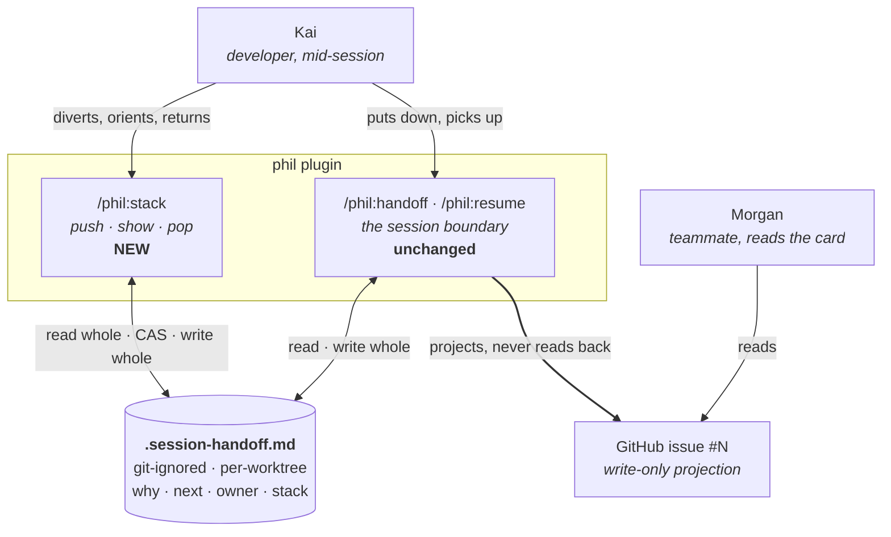
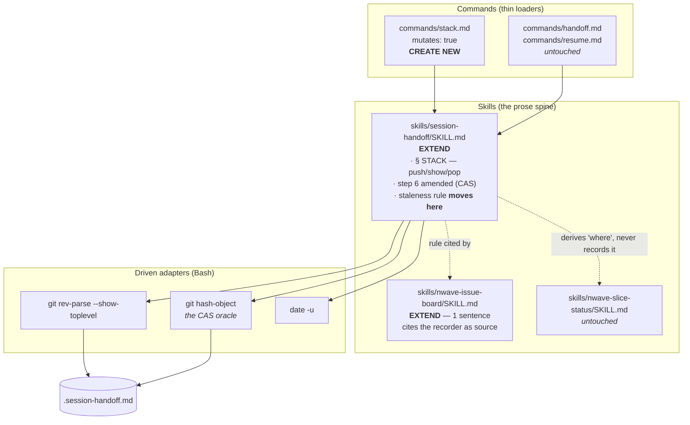

# Feature Delta — live-work-stack

Issue: [#29](https://github.com/pmvanev/phil-claude-plugin/issues/29) · Wave: DISCUSS (entered 2026-08-18)

The work stack has a format, a persistence step and a projection. It has no operations. This feature
gives it push, pop and show, and settles where write authority for it sits.

---

# Wave: DISCUSS (entered 2026-08-18)

## Wave: DISCUSS / [REF] Persona ID

**Kai** (`kai-session-relay`) — developer carrying multi-session AI-assisted work, who pays when the
handoff drops. Unchanged from `session-handoff`; no new persona. Morgan (`morgan-feature-owner`)
reads the projected copy but is not this feature's driver — the projection is untouched here.

## Wave: DISCUSS / [REF] JTBD one-liner

When I am several diversions deep in a session, I want to ask where I am and why — and to have
recorded each detour at the moment I took it — so I can return along the path I came rather than
reconstructing it from the transcript.

## Wave: DISCUSS / [REF] Locked decisions

| # | Decision | Verdict |
|---|---|---|
| **D1** | **Write authority stays in `.session-handoff.md`, with push and pop regenerating the WHOLE file.** Not a second file, not a carve-out. | Locked 2026-08-18 |
| **D2** | **The overwrite rule is amended, not excepted.** It forbids merging a snapshot *this session did not write*; rebuilding one it did was never what it prevented. | Locked 2026-08-18 |
| **D3** | **A push with no snapshot creates one carrying the stack alone.** A diversion is payload, so this is not the `NO-OP` case. | Locked 2026-08-18 |
| **D4** | **The staleness rule moves to the recorder.** It currently exists only in `nwave-issue-board`, on the projected copy. | Locked 2026-08-18 |
| **D5** | **One command, three verbs** — `/phil:stack push …`, `/phil:stack pop`, and bare `/phil:stack` to show. | Locked 2026-08-18 |
| **D6** | **`session:` in the delimited header** is the competing-snapshot discriminator. Detect and refuse; never resolve. | ~~Locked 2026-08-18~~ → **superseded by DDD-1** |

### D1 — why one file, and why this is not the carve-out

Issue #29 named two options and called neither obviously right: move the stack to its own file, or
give `/phil:handoff`'s overwrite rule a preserved section. The second is the two-writers-in-one-region
problem that slice 04's dogfood diagnosed and fixed **on the card side** three days earlier; adopting
it here would reintroduce on the file side the defect just removed on the card side.

The first is defensible — two files owning *different* facts is not the anxiety-B violation it looks
like, and `/phil:handoff` reading a file it does not own is exactly ADR-014's delegation pattern.
It was rejected because it buys nothing that D2 does not, at the cost of a second piece of session
state whose lifetime, staleness and session-ownership all have to be reasoned about separately.

**The third option is the one taken, and it exists because the rule says less than it appears to.**

### D2 — what the overwrite rule actually forbids

`skills/session-handoff/SKILL.md` step 6, quoted whole:

> **Write `.session-handoff.md`**, overwriting any previous snapshot outright — never merging into
> it. There is one snapshot per repository root, so a competing snapshot would need a second worktree
> on the same repo; that case was examined with slice 03 and left unhandled deliberately.

Every word of the stated rationale is about **a competing snapshot from another worktree**. The rule
is anti-arbitration, not anti-read. A single session reading its own snapshot, adding a frame and
regenerating the whole file does not do the thing that sentence was written to prevent.

So the rule is restated to say what it meant: *never merge into a snapshot this session did not
write.* `session:` (D6) makes that checkable, and a foreign snapshot is refused rather than
reconciled — slice 03's boundary, unchanged.

This is also why D1 is not a carve-out. A carve-out has two writers with a treaty between them.
Whole-file regeneration has **one** writer that owns everything it rewrites, which is precisely the
property `nwave-issue-board` fixture 19 relies on: *"a missing source renders `unknown`, which is what
makes whole-block regeneration incapable of destroying anything."*

### D4 — a correction to the card

Issue #29's Done-when reads: *"A never-popped frame is visible as stale rather than silently wrong,
per the rule already in `session-handoff`."* **The rule is not in `session-handoff`.** It is in
`skills/nwave-issue-board/SKILL.md:321` — *"A frame open longer than one boundary is marked"* — i.e.
in the publisher, governing the projected copy. The recorder has no staleness concept at all.

Slice 02 moves it, keeping the publisher's copy and naming the recorder as its source. The wording is
reused rather than re-derived, so no age threshold is invented.

## Wave: DISCUSS / [REF] Job story

`carry-work-across-session-boundaries` — **existing, validated, unchanged.** Registered by
`session-handoff` (2026-08-12), persona `kai-session-relay`. This feature adds a **live-view facet**,
recorded in `docs/product/jobs.yaml` beside the cross-person and design-axis facets already there.

### The facet, and why it is a facet

Every force on the parent job concerns the **session boundary**. This one lives entirely inside a
session — the same job, one time axis down.

| Dimension | Live-view facet |
|---|---|
| Functional | The stack gains **operations**, not just a format. A frame's **age** becomes readable, because a frame pushed and never popped is the failure mode. |
| Emotional | Relief from carrying the return path in working memory; confidence that going deeper is not the same as losing the way back. |
| Social | A teammate or a later self sees not just where work stopped but the path in. |

### Four forces

| Force | Content |
|---|---|
| **Push** | The stack is recorded only when the session is put *down* — precisely when Kai has stopped needing it. Three frames deep there is no command to run, and `.session-handoff.md` is empty *because no handoff has happened yet*. |
| **Pull** | Capture the reason for leaving while it is still in Kai's head; answer "where am I and why" without scrolling the transcript. |
| **Anxiety** | (A) A frame pushed and never popped is **worse than no stack** — the parent's anxiety A, applied to a frame. (B) Two writers on the snapshot — answered structurally by D1. (C) Ceremony: a frame for every two-minute detour costs more than the detour — the parent's anxiety D, answered by push being optional and never prompted for. |
| **Habit** | Holding the return path in working memory; scrolling the transcript; re-deriving intent from `git diff`. |

### The evidence, not the hypothesis

Slice 04 of `single-issue-per-feature` dogfooded the stack on 2026-08-14 and recorded the result
against itself:

> **The stack was empty, and that is the honest result.** … the first ever run of the stack feature
> had no stack to record — it exercised the *omit-rather-than-render-empty* rule instead of the
> rendering. Worth stating plainly: **the feature's headline mechanism is still unexercised**, and
> the run that was supposed to prove it proved its degenerate case instead.

The push force is an observed failure, not a projection.

### Opportunity score

`not-scored` — one job, already validated, single facet. Priority follows the parent.

## Wave: DISCUSS / [REF] Scope Assessment

**PASS — right-sized.** One of five oversized signals fires; two are required.

| Signal | This feature |
|---|---|
| >10 user stories | No — 4 |
| >3 bounded contexts | 3, and the third (`nwave-issue-board`) is one reconciled sentence |
| WS needs >5 integration points | No — the file, format and delimiters all exist |
| >2 weeks | No — 2 slices at ~1 day |
| Independent outcomes shippable separately | **Fires.** `show` alone is shippable |

The one that fires is fed into slicing rather than treated as a split: `show` ships **with** push in
slice 01 because a show with nothing to show demonstrates plumbing, which the carpaccio taste tests
reject as a slice in its own right.

## Wave: DISCUSS / [REF] Journey

`docs/product/journeys/live-work-stack.yaml` — new, sibling to `session-handoff.yaml`. Same persona,
same job, different time axis. Five steps, seven error paths.

`divert → descend → orient → return → wind-down`
Arc: about-to-lose-the-thread → held → oriented → resolved → relief. **Upward.**

The fifth step is `/phil:handoff`, **unchanged**. It is in the journey to make explicit that this
feature alters nothing about the boundary — only whether the stack has anything in it when the
boundary arrives.

## Wave: DISCUSS / [REF] Slices and order

| # | Slice | Ships | Order rationale |
|---|---|---|---|
| 01 | Push and show, on the file that already holds the stack | S1, S3 | **WS.** Carries D1/D2 — the highest-uncertainty decision, so a failure costs one slice rather than the feature. |
| 02 | Pop on return, and a frame that outlived its welcome | S2, S4 | Needs slice 01's writer and session guard. Its own hypothesis (will Kai actually pop?) can only be tested once pushing is real. |

Prioritised by **learning leverage**: slice 01 holds the decision that could invalidate the design;
slice 02 holds the decision that could invalidate the *discipline*. Dependency runs the same way, so
the two orderings agree.

## Wave: DISCUSS / [REF] Driving ports

- `/phil:stack` — the sole new inbound surface. `push "<what>" "<why>"` · `pop` · bare = show.
- `skills/session-handoff/SKILL.md` — extended, not replaced. The stack's operations live beside the
  format they operate on.

No new driven ports. The file is the same file; the forge is not touched.

## Wave: DISCUSS / [REF] WS strategy

**C — real local resources.** The walking skeleton reads and writes the actual
`.session-handoff.md` in the actual repo. No adapter is faked because nothing external is involved:
the forge is out of scope by D1, and the one component this feature reconciles with
(`nwave-issue-board`) is prose.

This is the strategy `session-handoff` slice 01 used, for the same reason.

## Wave: DISCUSS / [REF] Pre-requisites

| Needed | State |
|---|---|
| `.session-handoff.md`, git-ignored, at repo root | Shipped — ADR-013 |
| The delimited `<!-- session-handoff:v1 -->` header | Shipped — `session-handoff` slice 01 |
| The `## Stack` format, frames innermost-last | Shipped — `single-issue-per-feature` slice 04 |
| The projection that renders the stack | Shipped — same slice; **untouched here** |
| A competing-claim boundary (detect, do not resolve) | Shipped — `session-handoff` slice 03 |

Nothing blocks slice 01.

## Wave: DISCUSS / [REF] User stories

All four carry `job_id: carry-work-across-session-boundaries`.

### Story 1 — Record a diversion as it happens (slice 01)

As Kai, when I leave the task in hand for something blocking it, I want to record what I am entering
and why before I lose the reason, so the return path is written down rather than remembered.

#### Elevator Pitch
Before: a diversion is recordable only at `/phil:handoff`, when the session is already ending.
After: run `/phil:stack push "deploy script" "blocked the blocker"` → sees `pushed frame 3 · stack now 3 deep · deploy script`
Decision enabled: whether to go deeper now, knowing the way back is recorded rather than held in my head.

**AC1.1** Given a snapshot with a `Why` and a `Next`, when a frame is pushed, then both are byte-identical afterwards and the stack is one frame deeper.
**AC1.2** Given a snapshot that changed between read and write, when a frame is pushed, then the push is refused, both hashes are reported, and nothing is written. *(Mechanism revised by DESIGN DDD-1; the assertion is unchanged.)*
**AC1.3** Given no snapshot, when a frame is pushed, then one is created whose `## Stack` is populated and whose `Why` and `Next` are absent rather than invented.

### Story 2 — Return to the parent frame (slice 02)

As Kai, when a detour closes, I want to drop the innermost frame and be told what I am back to, so
returning is navigated rather than recalled.

#### Elevator Pitch
Before: a frame is popped by hand-deleting a line from a file I have to open and find.
After: run `/phil:stack pop` → sees `popped · back to: fixture 07 contradicted the wave table · stack now 2 deep`
Decision enabled: whether the parent frame is still what I want to be doing, or whether it too should be popped.

**AC2.1** Given depth 3, when popped, then depth is 2, the frame now in hand is named, and `Why`/`Next` are byte-identical.
**AC2.2** Given an empty or absent stack, when popped, then the emptiness is stated and **nothing is written**.

### Story 3 — Ask where I am, at depth (slice 01)

As Kai, several diversions deep, I want the whole trace on demand, so I can answer "where am I and
why" without scrolling the transcript.

#### Elevator Pitch
Before: no command displays the stack mid-session; `/phil:resume` reads it only at session start.
After: run `/phil:stack` → sees the three frames, innermost marked, each with what it is, why it was entered, and how long it has been open
Decision enabled: whether to keep going down, pop back, or stop — which requires seeing the depth, not just the current frame.

**AC3.1** Given depth 3, when shown, then all three frames render with what, why and age, innermost marked.
**AC3.2** Given no snapshot, when shown, then `unknown` renders — never `none`. Given a snapshot with no `## Stack`, `none` renders. The two are distinct.

### Story 4 — See a frame that has gone stale (slice 02)

As Kai, I want a frame I pushed and never popped to be marked, so a stack I have stopped maintaining
stops looking maintained.

#### Elevator Pitch
Before: a frame open for three days is indistinguishable from one opened five minutes ago.
After: run `/phil:stack` → sees `⚠ open across 1 boundary` beside the frame, and an age on every frame
Decision enabled: whether to trust the stack at all — a stale frame means the record diverged from what I am actually doing.

**AC4.1** Given a frame open across a `/phil:handoff` capture, when shown, then it is marked.
**AC4.2** Every frame carries its age, marked or not.
**AC4.3** The rule is stated in `skills/session-handoff/SKILL.md`, and `nwave-issue-board`'s copy names the recorder as its source.

**Slice composition:** no slice is `@infrastructure`-only. Slice 01 carries S1 and S3, slice 02 carries
S2 and S4; all four have user-visible output.

## Wave: DISCUSS / [REF] Outcome KPIs

| # | KPI | Target | Measurement |
|---|---|---|---|
| **KPI-1** | The headline mechanism is exercised on real work — the thing slice 04 could not measure | ≥1 push **and** pop pair on a genuine diversion in this repo, recorded in the slice result | Slice result section, naming the diversion |
| **KPI-2** | Payload survival across stack operations | **100%** — `Why` and `Next` byte-identical across every push and pop | Fixture (AC1.1, AC2.1) + `diff` on the live dogfood |
| **KPI-3** | Orientation without the transcript | Depth-3 `show` answers "where am I and why" in **<10 s**, no scrollback | Timed dogfood at depth ≥3 |
| **KPI-4** | Competing snapshots are refused, never merged | **0** merges attempted | Fixture (AC1.2) |
| **KPI-5** | Ceremony stays optional | **0** prompts to push; `/phil:handoff` and `/phil:resume` behave identically when the stack is never used | Fixture: a session that never pushes produces the same outputs as today |

KPI-1 is the one that matters. Slice 04 shipped a mechanism and recorded that it had never run;
this feature is not done until it has.

## Wave: DISCUSS / [REF] Definition of Ready — validation

| # | DoR item | Status | Evidence |
|---|---|---|---|
| 1 | Job traceable | ✅ | `carry-work-across-session-boundaries`, live-view facet added to `jobs.yaml`; all 4 stories carry it |
| 2 | Persona defined | ✅ | `personas/kai-session-relay.yaml` — existing, unchanged |
| 3 | Journey mapped | ✅ | `journeys/live-work-stack.yaml` — 5 steps, 7 error paths, upward arc |
| 4 | Stories have elevator pitches | ✅ | All 4, each naming a real invocation and concrete stdout |
| 5 | ACs testable | ✅ | 10 ACs, each fixture-checkable; AC1.1/AC2.1 are byte-identity assertions |
| 6 | Slices ≤1 day, learning hypothesis each | ✅ | 2 briefs, both ≤100 lines, taste tests recorded per brief |
| 7 | Walking skeleton identified | ✅ | Slice 01 — push + show end-to-end on the real file; pop deliberately excluded |
| 8 | Outcome KPIs with targets | ✅ | KPI-1…5; three are hard numbers, two fixture-measured |
| 9 | Scope right-sized / split confirmed | ✅ | PASS on 1-of-5 signals; the one that fires is absorbed into slice 01 with its reason |

**Requirements completeness: 0.96.** The residue, named so the number is auditable: the *interaction
between a mid-session push and a compaction event* is unspecified. `.session-handoff.md` survives
compaction, so the stack does — but whether the session identity in `session:` survives a compaction
is not knowable from the docs and must be established empirically in slice 01. It is recorded as a
DESIGN open question rather than guessed. *(Dissolved by DDD-1 — there is no session identity.)*

**Per-wave peer review: skipped**, per the skill's default. No trigger fired — the DoR surfaced no
ambiguity, the job was already validated, there is no vendor-neutrality surface, and none was
requested. The consolidated review fires at end of DISTILL.

## Wave: DISCUSS / [REF] Out-of-scope

- **Arbitration between two live sessions.** Detected and refused; never resolved. Inherited verbatim
  from `session-handoff` slice 03, and *more* likely now that competition is checked at all
  (`session:` per D6, then the compare-and-swap that replaced it — DDD-1).
- **Automatic push, via a `Stop` hook or otherwise.** The reason is the payload and no hook can see
  it — the same ground on which ADR-014 deferred the hook.
- **Automatic expiry or auto-pop.** A frame the tool closed is a frame whose reason nobody read.
  Marking is the limit; slice 02's hypothesis is what would revisit it.
- **Popping anything but the innermost frame.** That is editing the stack, not navigating it.
- **Any change to the projection or to `/phil:handoff`'s capture.** It reads the same file it always
  wrote. Stated as out-of-scope rather than silently skipped: *no work needed* is a finding.
- **Cross-person stack visibility.** Morgan reads the projection, which is untouched.
- **Retiring `.session-handoff.md`** or moving the stack out of it — that is D1, decided.

## Wave: DISCUSS / [REF] Wave decisions summary

### Key decisions

- **[D1]** Write authority stays in one file, with whole-file regeneration — not a second file, not a
  carve-out (see: this document, D1)
- **[D2]** The overwrite rule is amended to say what its own rationale meant: never merge a snapshot
  *this session did not write* (see: `skills/session-handoff/SKILL.md` step 6)
- **[D3]** A push with no snapshot creates one carrying the stack alone; a diversion is payload
- **[D4]** The staleness rule moves to the recorder, correcting issue #29's own premise
- **[D5]** One command, three verbs: `/phil:stack`
- **[D6]** `session:` in the header is the competing-snapshot discriminator — **superseded by DDD-1**

### Requirements summary

- **Primary need:** the work stack has a format, persistence and a projection, but no operations. It
  is recorded only when the session ends — which is when it stops being useful. Kai needs push at the
  moment of diversion, show at any depth, and pop on return.
- **Walking skeleton:** slice 01 — push and show against the real `.session-handoff.md`, carrying the
  write-authority decision so a failure costs one slice.
- **Feature type:** cross-cutting — command surface, snapshot format and write rule, and one
  reconciled sentence in the publisher.

### Constraints established

- One authority for the stack: `.session-handoff.md`. One writer per operation, owning the whole file.
- A foreign snapshot is **refused**, never merged. Detection without resolution, inherited.
- No hook, no auto-push, no auto-pop — the reason is the payload and only a human holds it.
- `/phil:handoff`, `/phil:resume` and the projection are untouched. A session that never pushes sees
  no change at all (KPI-5).
- `commands/stack.md` declares `mutates: true`, and its `Bash(...)` grant carries no path and no
  variable, per `CLAUDE.md`.

### Upstream changes

- **`docs/product/jobs.yaml`** — live-view facet on `carry-work-across-session-boundaries`; the job
  itself is unchanged and `features:` gains `live-work-stack`.
- **`docs/product/journeys/live-work-stack.yaml`** — new journey, sibling to `session-handoff.yaml`.
- **No ADR is amended by DISCUSS.** ADR-013's surface decision stands untouched: the snapshot is still
  one git-ignored root dotfile. What changes is a rule inside `SKILL.md`, which is not an ADR-level
  decision. DESIGN should confirm this rather than inherit it.

### Downstream note for DESIGN

Three questions this wave deliberately did not answer:

1. **Does `session:` survive compaction?** The named residue in the completeness score. If it does
   not, every post-compaction push refuses itself, and the discriminator needs a different source.
   **→ Answered by DDD-1: the question is void, because there is no session identity.**
2. **Per-repo or per-worktree?** ADR-013 left this open for `/phil:handoff` and it is now sharper:
   `EnterWorktree` puts two trees on one initiative, and push makes writes frequent rather than
   once-per-session. **→ Answered by DDD-2: per-worktree, by construction, since slice 01.**
3. **Is the amended overwrite rule an ADR?** DISCUSS says no — it is a rule inside a skill, not a
   surface decision. DESIGN owns the call. **→ Answered by DDD-3: ADR-013 is amended; no new ADR.**

---

# Wave: DESIGN (entered 2026-08-18)

Scope: **application / components**. Interaction mode: **propose**. No system or domain lane ran —
the deliverable is prose, so there is no runtime to scale and no domain model to decompose. What
DESIGN owns here is *which component owns which rule*, the file contract, and the three questions
DISCUSS deferred.

## Wave: DESIGN / [REF] DDD list

| # | Decision | Verdict |
|---|---|---|
| **DDD-1** | **Compare-and-swap replaces session identity.** Hash the file at read, re-hash immediately before write, refuse if it moved. **Supersedes DISCUSS [D6].** | Locked |
| **DDD-2** | **The snapshot is already per-worktree**, by construction, since slice 01. Recorded, not decided — this closes ADR-013's open question. | Recorded |
| **DDD-3** | **ADR-013 is amended, not superseded, and no new ADR is written.** | Locked |
| **DDD-4** | **`git hash-object` is the hash.** Not `sha256sum`, not `shasum`. | Locked |
| **DDD-5** | **EXTEND `skills/session-handoff/SKILL.md`.** The only CREATE NEW is `commands/stack.md`. | Locked |
| **DDD-6** | **A failed compare-and-swap refuses and reports. It never retries and never loops.** | Locked |
| **DDD-7** | **One staleness rule, two statements, one named source.** The recorder owns it; the publisher keeps its copy and cites the recorder. | Locked |
| **DDD-8** | **No driven ports are added.** The forge is untouched by this feature. | Locked |

### DDD-1 — why identity was the wrong guard

DISCUSS locked `session:` in the header as the competing-snapshot discriminator. Tracing the primary
journey against it shows the guard refuses the normal case:

```
session N     /phil:handoff       writes snapshot, session: N
                 ── boundary ──
session N+1   /phil:resume        reads it, resumes the work
session N+1   hits a blocker
session N+1   /phil:stack push    header says N, I am N+1  →  REFUSED
```

**Every session after the first would be refused on its first push.** D6 guards *authorship*, but
resuming another session's snapshot is the entire purpose of the feature the file belongs to — so the
normal path and the hazard are indistinguishable to that check.

The failure actually worth preventing is a **lost update**: A reads, B writes, A writes, B's frame is
gone with a call that reports success. That is detectable without identity:

```
read    h1 = git hash-object .session-handoff.md
modify  add or drop a frame, in memory, from the whole parsed file
verify  h2 = git hash-object .session-handoff.md      # re-read, immediately before writing
        h2 ≠ h1  →  REFUSE, report both hashes, write nothing
write   the whole file
```

The window between `verify` and `write` is one tool call. This is optimistic concurrency, the
standard shape, and it is **strictly stronger than D6 on the case D6 was written for**: a live
competitor is caught whether or not it bothered to stamp a header.

It also dissolves DISCUSS open question 1 — *does `session:` survive compaction?* There is no
`session:`. Nothing has to survive anything.

### DDD-2 — per-worktree, and it always was

`skills/session-handoff/SKILL.md` resolves the path as `$(git rev-parse --show-toplevel)/.session-handoff.md`.
Probed 2026-08-18 in a linked worktree:

```
main    git rev-parse --show-toplevel  →  …/main-repo
linked  git rev-parse --show-toplevel  →  …/linked          ← the worktree's own root
linked  git rev-parse --git-common-dir →  …/main-repo/.git
```

So each worktree already carries its own snapshot, and has since slice 01 shipped. ADR-013 recorded
this as *"Open (→ DELIVER): whether `.session-handoff.md` should be per-repo or per-worktree"* — the
answer is that the shipped code chose per-worktree and nobody noticed. It is also the right answer: a
worktree is a separate workspace holding separate work in flight, and `EnterWorktree` exists precisely
to isolate it.

**Residue, stated rather than resolved:** two worktrees on one feature project to *one card*. That is
arbitration, out of scope since `session-handoff` slice 03, and unchanged here.

### DDD-4 — the hash tool is a portability decision

`sha256sum` is GNU coreutils; macOS ships `shasum` instead. Depending on either splits the skill's
prose across platforms. `git hash-object` is present wherever git is — and git is already a hard
dependency, because the path resolution in DDD-2 is a `git rev-parse` call. Probed: it also works on
files outside any repository, so it does not depend on the snapshot being tracked (it is git-ignored).

Zero new dependencies, one code path.

### DDD-6 — refuse, never retry

A compare-and-swap that retries on failure is a loop that resolves a competing write by overwriting
it, which is the arbitration `session-handoff` slice 03 declared out of scope and this feature
inherits. Refusing and naming both hashes leaves the human to resolve it, which is the honest limit.

## Wave: DESIGN / [REF] Component decomposition

| Component | Path | Change |
|---|---|---|
| `/phil:stack` loader | `commands/stack.md` | **CREATE NEW** — `mutates: true`, grant carries no path and no variable |
| Stack operations | `skills/session-handoff/SKILL.md` | **EXTEND** — new `STACK` section (push · show · pop), amended step 6, the staleness rule |
| Snapshot contract | `.session-handoff.md` | **EXTEND** — `## Stack` gains age semantics. **Header unchanged**: DDD-1 removes the `session:` field DISCUSS proposed adding |
| Staleness cross-reference | `skills/nwave-issue-board/SKILL.md` | **EXTEND** — one sentence citing the recorder as the rule's source |
| Snapshot surface ADR | `docs/product/architecture/adr-013-…md` | **AMEND** — write frequency and the concurrency guard |
| Fixtures | `skills/session-handoff/self-test/16…` | **CREATE NEW** (data, not components) |

`commands/handoff.md` and `commands/resume.md` are **not modified**. `/phil:handoff`'s step 6 rule is
restated in the skill; its behaviour is unchanged, which is what KPI-5 measures.

## Wave: DESIGN / [REF] Driving ports

| Port | Surface | Verbs |
|---|---|---|
| `/phil:stack` | slash command → `skills/session-handoff/SKILL.md § STACK` | `push "<what>" "<why>"` · `pop` · bare = show |

One inbound surface. `/phil:handoff` and `/phil:resume` remain the boundary ports and are untouched.

## Wave: DESIGN / [REF] Driven ports and adapters

| Driven port | Adapter | Note |
|---|---|---|
| Snapshot read/write | `Read` / `Write` on `$(git rev-parse --show-toplevel)/.session-handoff.md` | The only side effect |
| Content hash | `git hash-object` (DDD-4) | Read-only |
| Repo root | `git rev-parse --show-toplevel` | Read-only; already used by the skill |
| Clock | `date -u` at minute precision | Matches the existing `captured:` stamp |

**No forge adapter.** DDD-8 — the projection is `/phil:handoff`'s and is not reached from any verb here.

## Wave: DESIGN / [REF] Technology choices

**None.** The deliverable is prose: one markdown command loader and one markdown skill section. No
language, framework or runtime is selected, and no development paradigm is declared — consistent with
every prior feature in `docs/product/architecture/brief.md`, which records the pattern as *"modular
prose skill, ports-and-adapters … No paradigm declared — the deliverable is prose with Bash adapters."*

Pinned: `git` (already required), and nothing else. Explicitly **not** pinned: `sha256sum`, `shasum`,
`python3`, `jq` — see DDD-4.

## Wave: DESIGN / [REF] Reuse Analysis

| Existing component | File | Overlap | Decision | Justification |
|---|---|---|---|---|
| session-handoff skill | `skills/session-handoff/SKILL.md` | Owns the snapshot file, the `## Stack` format, and the write rule the new verbs must obey | **EXTEND** | The format and the writer already live here. A new skill would hold operations over a contract it does not own — two authorities over one file, which is anxiety B exactly. One new section against a duplicated spine. |
| `/phil:handoff` | `commands/handoff.md` | Also writes `.session-handoff.md` | **EXTEND, by amending the shared rule** | Not edited. Its step 6 is restated once in the skill so both writers obey one rule rather than two copies of one. |
| `/phil:resume` | `commands/resume.md` | Also reads the snapshot and displays its contents | **EXTEND — rejected; leave unchanged** | Considered and declined at DISCUSS [D5]. `resume` is a boundary command whose whole framing is session start; folding a mid-session verb into it reproduces the framing error that created this gap. |
| nwave-issue-board skill | `skills/nwave-issue-board/SKILL.md` | Holds the only staleness rule in the codebase (`:321`) | **EXTEND** | One sentence. Moving the rule out wholesale would leave the projection unable to state its own semantics; DDD-7 keeps both statements and names one source. |
| refactor-loop ledger | `.refactor-loop-ledger.md` | Root dotfile, git-ignored, runtime state, concurrent writers | **Neither — precedent only** | No functional overlap. Cited by ADR-013 as the convention being reused; nothing to extend. |
| `/phil:work` progress trail | `docs/work/<slug>/progress.md` | Also records in-flight position | **Neither** | Settled by ADR-014: it owns discipline within an initiative, not the session. Composed unchanged, and not touched by this feature. |

**One CREATE NEW: `commands/stack.md`.** Justified because a command file *is* the inbound surface —
there is no existing command that can carry a third verb set without becoming the folded-into-handoff
option [D5] rejected. It is a loader, not logic; the logic goes into the EXTENDed skill.

## Wave: DESIGN / [REF] C4 — System Context



The only edge this feature adds is `Stack ↔ Snap`. Nothing new touches the forge.

## Wave: DESIGN / [REF] C4 — Container



Dependencies point inward: loaders → skill → adapters. The skill states rules; the adapters touch the
world; the commands only route. `S1 ⇢ S3` is ADR-014's delegated derivation, unchanged.

## Wave: DESIGN / [REF] Decisions table

| DDD | Decision |
|---|---|
| DDD-1 | Compare-and-swap via content hash replaces session identity; supersedes DISCUSS D6 |
| DDD-2 | Snapshot is per-worktree by construction; ADR-013's open question closed |
| DDD-3 | ADR-013 amended; no new ADR |
| DDD-4 | `git hash-object` is the hash; no coreutils dependency |
| DDD-5 | EXTEND the session-handoff skill; CREATE NEW only the command loader |
| DDD-6 | A failed CAS refuses and reports; never retries |
| DDD-7 | One staleness rule, two statements, recorder named as source |
| DDD-8 | No driven ports added; the forge is untouched |

## Wave: DESIGN / [REF] Open questions

Deferred to DISTILL/DELIVER, deliberately:

1. **What counts as "one boundary" when no `/phil:handoff` runs for days?** **→ Partly answered by
   slice 02: the count is dropped, the bit is kept.** `⚠ stale` means *open across a capture*, derived
   from `open since` < `captured:`; `captured: never` marks nothing. The original concern stands and is
   now explicit rather than latent: **a session that never captures never marks anything**, so a stack
   can still go stale invisibly. No age threshold was invented. Whether one is needed is what slice 02's
   learning hypothesis tests in use.
2. **`core.autocrlf` and the hash.** ~~Needs one fixture before slice 01 closes.~~ **→ Answered by
   probe, 2026-08-18: not a defect.** `git hash-object` *normalises* under `autocrlf=true`/`input` — a
   CRLF file and its LF twin hash identically — but it stays a pure function of content and config, so
   an unchanged file hashes the same twice and the compare-and-swap produces no spurious refusals. The
   residue: a competing write changing *only* line endings is invisible to the guard. Not fixtured; a
   fixture there tests git's determinism, not this skill.
3. **Whether `pop` should echo the popped frame's age.** **→ Answered by slice 02: it echoes the
   *staleness*, not the age.** Where the popped frame carried `⚠ stale`, `pop` says so — a frame that
   outlived a boundary and is closed silently takes with it the only signal the record had drifted. The
   raw age was not added; the mark is what the reader acts on.

## Wave: DESIGN / [REF] Changed Assumptions

DESIGN supersedes one locked DISCUSS decision. Recorded here rather than edited in place, per the
back-propagation contract.

**Original, quoted verbatim** from `## Wave: DISCUSS / [REF] Locked decisions` above:

> | **D6** | **`session:` in the delimited header** is the competing-snapshot discriminator. Detect and refuse; never resolve. | Locked 2026-08-18 |

**New assumption:** there is no session identity in the snapshot. The competing-write discriminator is
a **content hash compared across the read-modify-write window** (DDD-1).

**Rationale:** D6's guard refuses the primary journey path — every session after the first is refused
on its first push, because resuming a previous session's snapshot is what the file exists for. The
replacement detects the failure that matters (lost update) rather than the property that does not
(authorship), permits the normal path, and eliminates DISCUSS open question 1 entirely.

**Consequential edits to prior-wave artifacts**, made rather than left stale, because DELIVER consumes
the slice briefs directly:

- `slices/slice-01-push-and-show.md` — the `session:` bullet in IN scope, and AC1.2, restated as the
  compare-and-swap guard. The **assertion is unchanged**: a competing write is refused and nothing is
  written. Only the mechanism moved.
- `## Wave: DISCUSS / [REF] User stories` — AC1.2's wording, same assertion.
- The DISCUSS **D6 row is left standing** with its Locked stamp, so the change is legible as a
  revision rather than a rewrite of history.

Nothing else changes: D1 through D5 stand, all four stories stand, KPI-1 through KPI-5 stand, and the
scope assessment is unaffected.

## Wave: DESIGN / [REF] Wave decisions summary

### Architecture summary

- **Pattern:** modular prose skill with ports-and-adapters — the `refactor-tests` → `phil-work` →
  `edd-loop` → `adversarial-review` → `session-handoff` lineage, unchanged.
- **Paradigm:** none declared. The deliverable is prose with Bash adapters.
- **Key components:** `commands/stack.md` (new loader) over an EXTENDed
  `skills/session-handoff/SKILL.md`; one sentence into `skills/nwave-issue-board/SKILL.md`; ADR-013
  amended.
- **Safety oracle:** the compare-and-swap. Where `session-handoff` v1's oracle is the *staleness
  verdict* across the boundary, this feature's is *lost-update detection* within it.

### Constraints established

- One authority for the stack, one writer per operation, whole-file regeneration.
- A failed CAS **refuses and reports both hashes**; it never retries, never merges, never resolves.
- No new dependency beyond `git`, which was already required.
- `/phil:handoff`, `/phil:resume` and the projection are behaviourally untouched — KPI-5 is the check.
- The snapshot stays per-worktree, git-ignored, at the worktree root.

### Upstream changes

- **DISCUSS [D6] superseded by DDD-1** — see `## Wave: DESIGN / [REF] Changed Assumptions`.
- **ADR-013 amended** — write frequency and the concurrency guard. Its surface decision (a single
  git-ignored root dotfile) is untouched, and its open question on per-repo vs per-worktree is closed
  by DDD-2.
- `docs/product/architecture/brief.md` gains a `### live-work-stack` section.

### Handoff

DEVOPS does not run — there is nothing to deploy. DISTILL and DELIVER do not run in this repo either;
skills are authored, not test-driven. The next step is **authoring slice 01**, which per `CLAUDE.md`
means consulting `plugin-dev:command-development` and `plugin-dev:skill-development` *before* writing
the files, then `plugin-dev:skill-reviewer` and `plugin-dev:plugin-validator` over the result.
