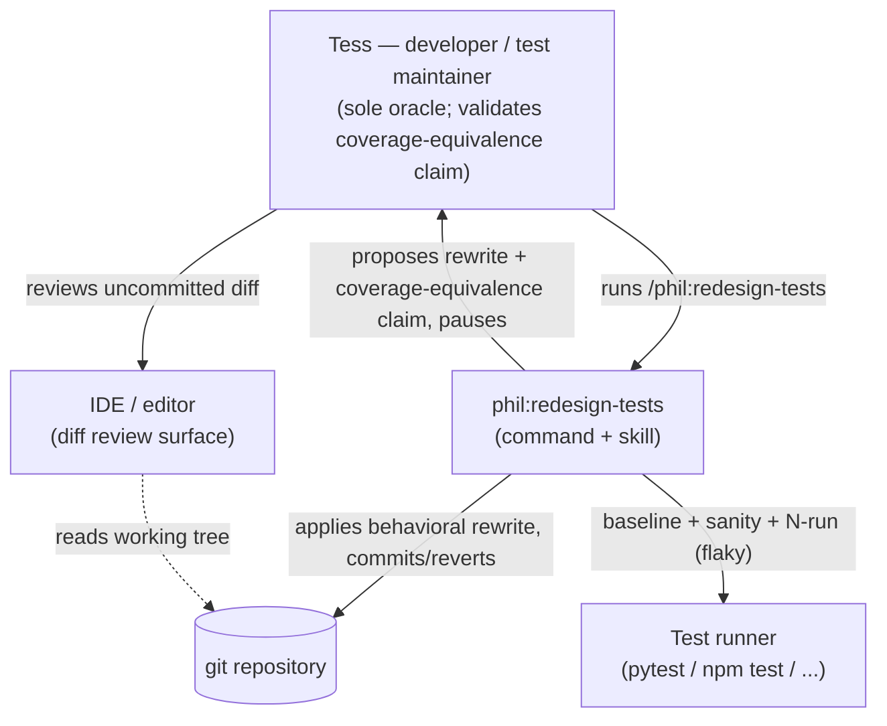
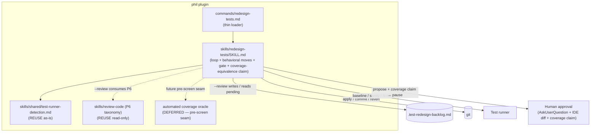

# Feature Delta — redesign-tests (`/phil:redesign-tests`)

**Wave:** DISCUSS (wave 2 of 6) · **Date:** 2026-07-06 · **Agent:** Luna (nw-product-owner)
**Type:** user-facing plugin feature (prose skill) · **Feature ID:** redesign-tests

---

## Wave: DISCUSS / [REF] Persona

**`tess-test-maintainer`** (Tess) — developer / test-suite maintainer in a repo using the phil
plugin. Reused verbatim from SSOT (`docs/product/personas/tess-test-maintainer.yaml`); no new
persona introduced.

---

## Wave: DISCUSS / [REF] JTBD one-liner

Under the existing validated job **`keep-test-suite-trustworthy`**: *When my tests are welded to
how the code works — asserting on private calls, mock interactions, or nondeterministic internals
— so they break on every refactor and don't actually protect behavior, I want to rewrite them to
verify what the code does, one human-approved diff at a time, so my suite survives refactoring and
catches real regressions instead of noise.*

- **Functional:** rewrite implementation-coupled / over-mocked / flaky assertions into
  behavior-focused ones, gated by per-diff human approval.
- **Emotional:** relief that tests stop crying wolf on every refactor; confidence they now guard
  behavior, not structure.
- **Social:** a suite teammates trust as a specification, not a change-detector.

This feature is registered under the **same job** as `refactor-tests` (per user decision D-Job),
but occupies the opposite pole: `refactor-tests` cleans structure *without* changing what is
verified; `redesign-tests` *deliberately changes* what is verified. See Changed Assumptions for
the back-propagated four-forces update.

---

## Wave: DISCUSS / [REF] Locked decisions

| ID | Decision | Verdict / Rationale |
|----|----------|---------------------|
| D1 | **Scope = all behavior-changing smells** | In-bounds: implementation-coupling, excessive mocking, flakiness/determinism (the full `rules/testing.md` §Anti-Patterns behavior-changing set). Sliced by family; flakiness is the last, most tentative slice (S4) and may spin off. |
| D2 | **Oracle = human-only (per-diff approval)** | No automated coverage oracle in v1. The human reviewing the IDE diff is the sole oracle — same model as `refactor-tests` ADR-002, but over behavior-changing moves. |
| D3 | **Human approves every rewrite** | Even though the suite is re-run as a sanity check, a green suite never auto-applies. Approve / reject / skip / quit per diff, reviewed in the editor. No chat diffs. |
| D4 | **Same job, new feature** | Add `redesign-tests` to `keep-test-suite-trustworthy.features`; do not mint a new job. |
| D5 | **Reuse the `refactor-tests` loop shape** | apply → suite sanity check → auto-revert-on-red → human gate → one-commit-per-item. The *only* changes vs. `refactor-tests`: allowed moves expand to behavioral rewrites, and the detected smell set expands. |
| D6 | **Separate backlog file** | `.test-redesign-backlog.md`, distinct from `.test-refactoring-backlog.md`, so the two tools never collide (same convention ADR-001 established). |
| D7 | **Accepted risk (v1)** | Human-only oracle cannot *guarantee* coverage was not silently narrowed — the failure mode a mutation test would catch and a human eye can miss. Consciously accepted for v1; automated coverage oracle deferred (see Out-of-scope + Deferred). |

---

## Wave: DISCUSS / [REF] User stories with elevator pitches

All stories: `job_id: keep-test-suite-trustworthy`.

### S1 — Redesign one implementation-coupled test (walking skeleton)

As Tess, I want the tool to rewrite a single test that asserts on *how* the code works into one
that asserts *what* it does, gated by my approval, so the test survives refactoring.

**Elevator Pitch**
Before: I have a test asserting `mock.save.called` that breaks whenever I refactor internals.
After: run `/phil:redesign-tests path/to/test_x.py::test_name` → tool applies a behavioral rewrite, suite goes green, I review the uncommitted diff in my IDE and approve → sees the committed behavioral rewrite.
Decision enabled: I decide whether the new assertion still catches the regressions the old one did.

**Acceptance criteria**
- AC1.1 — Proposes exactly one rewrite (never bundles).
- AC1.2 — Applies to the working tree, then re-runs the suite as a sanity check.
- AC1.3 — Never reaches the human on red: post-apply red → `git checkout` auto-revert, mark blocked, continue.
- AC1.4 — Human answers approve / reject / skip / quit against the real git diff in the IDE; no diff printed in chat.
- AC1.5 — approve → exactly one commit (only the touched test file); reject/skip/quit → clean `git checkout` revert, nothing written.
- AC1.6 — The proposal states *what the test verifies now vs. before* (intent transparency).
- AC1.7 — Never redesigns on a red baseline (verify green before proposing).

### S2 — `--review` seeds the behavioral-smell backlog

As Tess, I want to scan a directory for behavior-changing smells and get a prioritized backlog.

**Elevator Pitch**
Before: I can't see which tests are coupled / over-mocked / flaky.
After: run `/phil:redesign-tests --review tests/` → sees `.test-redesign-backlog.md` with one item per smell (file:line, smell type, proposed rewrite intent, priority).
Decision enabled: I decide which rewrites to work and in what order.

**Acceptance criteria**
- AC2.1 — Detects only the in-scope behavioral smells, reusing `review-code`'s Priority 6 taxonomy (do not fork a divergent list).
- AC2.2 — Writes `.test-redesign-backlog.md` in `review-code`'s backlog format (by convention), separate from `.test-refactoring-backlog.md`.
- AC2.3 — Applies nothing in review mode.
- AC2.4 — Detection precision target: ≤20% of items rejected on first human review (K1).

### S3 — Redesign over-mocked tests toward real collaborators

As Tess, I want over-mocked tests rewritten to use real collaborators/fakes, with approval.

**Elevator Pitch**
Before: a test mocks everything and asserts on mock calls, proving nothing about real behavior.
After: run `/phil:redesign-tests <file>` → tool proposes a real-collaborator/fake rewrite → I approve the diff → sees committed rewrite.
Decision enabled: I decide if the real-collaborator version tests behavior faithfully.

**Acceptance criteria**
- AC3.1 — Same loop and safety guarantees as S1.
- AC3.2 — If a rewrite needs a fake/collaborator that does not already exist, the tool surfaces that and **skips** the item rather than inventing unreviewed scaffolding.

### S4 — Redesign flaky / nondeterministic tests *(last, most tentative)*

As Tess, I want flaky tests rewritten deterministically (inject clock, seed RNG), with approval.

**Elevator Pitch**
Before: a test uses `datetime.now()` / unseeded random and fails intermittently.
After: run `/phil:redesign-tests <file>` → tool proposes a deterministic rewrite → I approve → sees committed rewrite.
Decision enabled: I decide the determinism fix preserved intent.

**Acceptance criteria**
- AC4.1 — Same loop and safety guarantees as S1.
- AC4.2 — Adds an N-run stability sanity check before the human gate (re-run to confirm the flake is gone).
- AC4.3 — If the smell class appears to want a different oracle (re-run stability ≠ coverage), the report notes it as a spin-off signal.

---

## Wave: DISCUSS / [REF] Outcome KPIs

| KPI | Target | Measurement |
|-----|--------|-------------|
| K1 — `--review` precision | ≤20% items rejected on first human review | reject+skip at gate ÷ items proposed |
| K2 — Zero-red-to-human | 100% of rewrites reaching the gate pass the suite | gate-arrivals on green ÷ total gate-arrivals (auto-revert guarantee) |
| K3 — Safety invariant | 0 commits on red, 0 unapproved test writes, 0 bundled commits | git-log audit per run |
| K4 — Intent transparency | 100% of proposals state before/after "what it verifies" | proposal-format check |

---

## Wave: DISCUSS / [REF] Definition of Done

1. `/phil:redesign-tests` command + `skills/redesign-tests/SKILL.md` shipped (command→skill split).
2. All four stories' ACs satisfied and demonstrated on fixtures.
3. Safety invariants proven: never-on-red, auto-revert-on-post-apply-red, one-commit-per-item, no chat diffs, no unapproved test writes.
4. `--review` writes a separate `.test-redesign-backlog.md`.
5. Reuses `skills/shared/test-runner-detection.md` and `review-code` Priority 6 taxonomy without forking.
6. Self-test golden fixtures pin the safety behaviors (mirroring `refactor-tests/self-test/`).
7. KPIs K1–K4 measurable from a run.
8. SSOT updated: job features list + back-propagated four-forces; journey + persona linked.
9. Accepted-risk (D7) and deferred automated-oracle recorded in the evolution doc.

---

## Wave: DISCUSS / [REF] Out-of-scope (v1)

- **Automated coverage oracle** (mutation testing / deliberate-break-and-confirm) — *deferred
  follow-up* (see Deferred). v1 is human-only by decision D2.
- Deleting dead/duplicate tests; splitting or merging test files.
- Changing non-test (SUT) code.
- Languages beyond the `refactor-tests` current set (Python + TS/React); others recognized and skipped.
- Structure-only assertion-preserving cleanup — that is `refactor-tests`' job, not this one.

---

## Wave: DISCUSS / [REF] Walking Skeleton strategy

**Strategy A (brownfield, reuse-heavy).** S1 is the walking skeleton: the full loop exercised
end-to-end on a *single* implementation-coupled test. It reuses the entire `refactor-tests`
apply→suite→human-gate→commit machinery, so the skeleton is thin (no new abstraction to build
first). Highest learning leverage — it tests the core bet that a human can confidently approve a
behavioral rewrite from an IDE diff.

---

## Wave: DISCUSS / [REF] Driving ports

- **CLI / skill command:** `/phil:redesign-tests [--review <path> | <file-path> | <test-id>]`
  - `--review <path>` → detect + seed backlog, apply nothing.
  - `<file-path>` / `<test-id>` → scoped redesign loop.
  - no argument → work the existing `.test-redesign-backlog.md`.

---

## Wave: DISCUSS / [REF] Pre-requisites

- Reuses `skills/shared/test-runner-detection.md` (as-is).
- Reuses `review-code` Priority 6 Test Quality taxonomy for detection (do not modify `review-code`).
- Reuses the `refactor-tests` loop pattern + git safety mechanics.
- **DESIGN must decide (ADR):** new command vs. `--behavioral` mode of `refactor-tests`. ADR-001
  precedent (rejecting mode-overloading) suggests a new command; DESIGN owns the call.

---

## Wave: DISCUSS / [REF] Scope Assessment

**PASS (right-sized).** ~4 stories; 0 new bounded contexts; walking skeleton reuses the existing
loop (not >5 integration points); effort < 2 weeks. The "multiple independent outcomes" signal
maps cleanly to the three smell-family slices — intended carpaccio, not oversizing.

---

## Wave: DISCUSS / [REF] Slices (elephant carpaccio)

| Slice | Ships | Learning hypothesis (disproves if it fails) |
|-------|-------|---------------------------------------------|
| **S1 — WS: one coupling rewrite** | End-to-end loop on one implementation-coupled test → propose → apply → suite → human approves → commit | Disproves "a human can confidently approve a behavioral test rewrite from an IDE diff" if Tess distrusts/rejects the rewrites. The whole bet. |
| **S2 — `--review` seeds backlog** | Detect in-scope smells across a dir (reuse `review-code` P6), write `.test-redesign-backlog.md` | Disproves detection precision if >20% first-pass false positives (K1). |
| **S3 — over-mock rewrites** | Extend moves to replace over-mocking with real collaborators/fakes | Disproves "over-mock rewrites fit the same loop" if they routinely need out-of-band fake construction. |
| **S4 — flakiness rewrites** | Inject-clock / seed-RNG moves + N-run stability check | Disproves "flakiness belongs in this skill" if it wants a different oracle — candidate spin-off. |

Execution order = S1 → S2 → S3 → S4 (highest learning leverage first; S4 last as the most likely
to reveal it wants its own home). Slice briefs: `docs/feature/redesign-tests/slices/`.

---

## Changed Assumptions

DISCUSS decision D4 (same job) forces a back-propagated update to the validated job
`keep-test-suite-trustworthy` in `docs/product/jobs.yaml`.

**Original (verbatim, from `jobs.yaml` as bootstrapped by feature `refactor-tests`, 2026-07-01):**

> `anxiety: > (A) A green suite does not prove an assertion was not weakened. (B) The tool might
> touch tests I did not want touched. (C) The tool might make behavior changes to my tests I did
> not sanction.`

> `pull: > The same one-command, gated cleanup phil:refactor gives production code — but for tests.`

**New assumption + rationale:**
The arrival of `redesign-tests` under this job means "behavior changes to my tests" is no longer
purely an anxiety to prevent — it is a *sanctioned, per-diff-approved* capability. The job's forces
are extended (not overwritten — `refactor-tests` still owns the assertion-preserving pole):

- **pull** extends: *"…and safely fix tests that verify the wrong thing, one approved diff at a time."*
- **anxiety (C)** is reframed for the `redesign-tests` feature: *"a sanctioned behavioral rewrite
  could still silently narrow coverage (human-only oracle)"* — the D7 accepted risk.

DISCOVER documents are not modified (none exist for this feature). The `jobs.yaml` edit records
the feature addition and appends this forces refinement with a provenance note.

---

## Deferred / follow-ups

- **Automated coverage oracle slice** — mutation testing (mutmut/Stryker) or deliberate-break-and-
  confirm, slotted at the human-approval seam. Mirrors how `refactor-tests` deferred its test-diff
  critic (ADR-002 / slice 04). Build once v1 produces real human-review-burden and coverage-loss data.
- **S4 flakiness spin-off** — if the N-run stability oracle proves a poor fit for the coverage-oriented
  loop, extract flakiness into its own skill.
- **TS/React fixtures** — Python fixtures first; a `.test.tsx` fixture is the documented language gap
  (same gap `refactor-tests` carries).

---

# DESIGN wave

**Wave:** DESIGN (wave 3 of 6) · **Date:** 2026-07-06 · **Agent:** Morgan (nw-solution-architect)
**Scope:** Application / components · **Interaction mode:** propose · **Paradigm:** N/A (prose skill)

## Wave: DESIGN / [REF] DDD list

| ID | Decision | Verdict / one-line rationale |
|----|----------|------------------------------|
| DDD1 | **New command + new skill; copy the `refactor-tests` loop pattern** | Not a mode, not a shared-module extraction. Keeps two safety contracts separate; zero regression to shipped code. → ADR-003 |
| DDD2 | **Reuse boundaries** | `test-runner-detection.md` as-is; `review-code` P6 taxonomy read-only; separate `.test-redesign-backlog.md` by convention. `review-code`/`refactor-tests` untouched. → ADR-003 |
| DDD3 | **Human gate carries a coverage-equivalence claim** | Inherit ADR-002 apply-then-review; ADD a required before/after "what it caught then / catches now" claim the human validates. → ADR-004 |
| DDD4 | **Behavioral rewrite catalog (the moves), by smell family** | Coupling → *Assert on observable outcome*; Mocking → *Replace double with real collaborator / fake*; Flakiness → *Inject clock / static timestamp*, *Seed RNG*, *Isolate shared state*. |
| DDD5 | **Safety mechanics inherited verbatim** | Never-on-red baseline; auto-revert on post-apply red; one-commit-per-item; no chat diffs; never touch SUT. |
| DDD6 | **Flakiness (S4) adds an N-run stability check** | Determinism analog of the coverage claim; if it fits poorly, spin off (DISCUSS deferred). |
| DDD7 | **No automated oracle in v1; leave a pre-screen seam** | Propose step leaves the seam where a future mutation / break-confirm critic validates the claim before the human. Mirrors ADR-002 critic-deferral. → ADR-004 |
| DDD8 | **Prose skill, no development paradigm** | Markdown executed by the model (mirror `refactor-tests` DDD8). |
| DDD9 | **Self-test golden fixtures pin safety behaviors** | never-on-red stop; post-apply-red auto-revert; approve→commit; reject→clean revert; `--review`→behavioral-only backlog. Mirror `refactor-tests/self-test/`. |

## Wave: DESIGN / [REF] Component decomposition

| Component | Path | Change type |
|-----------|------|-------------|
| Command loader (thin) | `commands/redesign-tests.md` | CREATE NEW |
| Skill (loop + behavioral move catalog + smell taxonomy + gate + coverage-equivalence claim) | `skills/redesign-tests/SKILL.md` | CREATE NEW |
| Self-test golden fixtures | `skills/redesign-tests/self-test/` | CREATE NEW |
| Acceptance scenarios | `skills/redesign-tests/acceptance.feature` | CREATE NEW |

## Wave: DESIGN / [REF] Driving ports

- **CLI / skill command:** `/phil:redesign-tests [--review <path> | <file-path> | <test-id>]`
  - `--review <path>` → detect + seed `.test-redesign-backlog.md`, apply nothing.
  - `<file-path>` / `<test-id>` → scoped redesign loop.
  - no argument → work the existing `.test-redesign-backlog.md`.

## Wave: DESIGN / [REF] Driven ports + adapters

| Driven port | Adapter | Notes |
|-------------|---------|-------|
| Version control (apply / commit / revert) | `git` via Bash | one commit per approved item; `git checkout` revert |
| Test execution (baseline / sanity / N-run) | test runner via Bash | located by `test-runner-detection.md` |
| Backlog persistence | filesystem read/write | `.test-redesign-backlog.md` (separate from refactor-tests) |
| Behavioral-smell detection | `review-code` P6 taxonomy (read-only reference) | consumed by convention; `review-code` unchanged |
| Human approval (the oracle) | AskUserQuestion + IDE diff review | carries the coverage-equivalence claim (DDD3) |

## Wave: DESIGN / [REF] Technology choices

- **Runtime:** Markdown prose skill executed by the model (no language/framework pinned).
- **Adapters:** Bash (git, test runner), filesystem, AskUserQuestion.
- **Detection source:** `review-code` Priority 6 taxonomy.
- **Languages acted on (v1):** Python + TS/React (globs inherited from `rules/testing.md`, same set
  as `refactor-tests`); others recognized and skipped.

## Wave: DESIGN / [REF] Decisions table

| DDD | ADR |
|-----|-----|
| DDD1, DDD2 | ADR-003 (new command + reuse boundaries) |
| DDD3, DDD7 | ADR-004 (coverage-equivalence claim at the human gate) |
| DDD4, DDD5, DDD6, DDD8, DDD9 | (skill-internal; no separate ADR) |

## Wave: DESIGN / [REF] Reuse Analysis

| Existing Component | File | Overlap | Decision | Justification |
|--------------------|------|---------|----------|---------------|
| refactor-tests loop | `skills/refactor-tests/SKILL.md` | gated apply→suite→human-gate→commit/revert loop + safety mechanics | EXTEND (pattern-copy) | Same precedent as refactor-tests copying `phil:refactor`; differs only in moves/taxonomy/backlog. Shared-module extraction deferred (ADR-003). Import would refactor shipped code — regression risk. |
| test-runner-detection | `skills/shared/test-runner-detection.md` | locate + run suite | REUSE as-is | Identical need; no change |
| review-code P6 taxonomy | `skills/review-code/SKILL.md` | detect behavioral test smells | REUSE (read-only) | ADR-001 posture: leave review-code untouched; `--review` consumes P6 by convention |
| backlog format | `.test-refactoring-backlog.md` format | prioritized backlog file | EXTEND (new file) | `.test-redesign-backlog.md` — separate so tools never collide (ADR-001 convention) |
| human-approval port | ADR-002 apply-then-review | AskUserQuestion + IDE diff | EXTEND | Same mechanism + a required coverage-equivalence claim (ADR-004) |

**Zero unjustified CREATE NEW.** The only CREATE-NEW artifacts (command, skill, fixtures) have no
existing equivalent — a behavior-changing test tool does not yet exist in the plugin.

## Wave: DESIGN / [REF] Open questions (deferred to DISTILL/DELIVER)

- Final named-move list per smell family — DISTILL locks it via golden fixtures.
- S4 flakiness go/no-go (keep in-skill vs spin off) — decided by the N-run-oracle fit.
- Automated coverage oracle (mutation / break-confirm) — deferred slice; seam reserved (DDD7).
- TS/React self-test fixture — documented language gap.

## Wave: DESIGN / [REF] C4 — System Context

## Wave: DESIGN / [REF] C4 — Container

---

# DISTILL wave

**Wave:** DISTILL (wave 4 of 6) · **Date:** 2026-07-06 · **Agent:** Iris (nw-acceptance-designer)
**Reconciliation:** DISCUSS (D1–D7) + DESIGN (DDD1–9) consistent — **0 contradictions**.
**Feature shape:** prose skill (no application code) → project golden-fixture convention wins over
pytest-bdd/scaffolds (same call `refactor-tests` made). Outcomes-registry registration **skipped**
(methodology feature, no new typed code contract).

## Wave: DISTILL / [REF] Scenario list with tags

Scenario SSOT: `skills/redesign-tests/acceptance.feature`. Safety mechanics pinned by golden
fixtures under `skills/redesign-tests/self-test/`.

| Scenario | Tags | Fixture |
|----------|------|---------|
| A review pass seeds a prioritized behavioural backlog | `@us-S2 @review` | 05 |
| One approved behavioural rewrite is applied, verified, committed | `@us-S1 @walking_skeleton @human-gate` | 03 |
| A rejected rewrite leaves the suite untouched | `@us-S1 @error @human-gate` | 04 |
| A rewrite that breaks the suite is reverted before Tess is asked | `@us-S1 @error` | 02 |
| The tool never redesigns on a red suite | `@us-S1 @error` | 01 |
| An over-mock rewrite needing a non-existent fake is skipped | `@us-S3 @mocking` | 06 |
| The backlog is worked one approved rewrite at a time | `@us-S3 @us-S4 @loop @requires-human` | (dogfood) |
| A determinism rewrite is confirmed stable before Tess is asked | `@us-S4 @flakiness @requires-human` | (deferred — see gap) |
| Redesign can be scoped to a single file or test | `@us-S1 @scoped @requires-human` | (dogfood) |

## Wave: DISTILL / [REF] WS strategy

Walking skeleton = **fixture 03** (`@walking_skeleton`, S1): one implementation-coupling rewrite
driven end-to-end through the gated loop (apply → suite green → surface coverage-equivalence claim →
human approves → one commit). Litmus: a maintainer at the gate confirms "yes — I can judge that
rewrite and I'd approve it." No per-feature Strategy A/B/C/D negotiation (prose skill; the "adapters"
are git + pytest + AskUserQuestion, driven by human/model exactly as `refactor/self-test/` is).

## Wave: DISTILL / [REF] Adapter coverage table

| Adapter | Exercised with real I/O | Covered by |
|---------|-------------------------|------------|
| git (apply / commit / revert) | YES | 02 (revert), 03 (commit), 04 (revert) — real `git apply` + `git checkout` in scratch |
| test runner (pytest) | YES | all fixtures — real `python -m pytest` baselines |
| filesystem backlog | YES | 05 — writes real `.test-redesign-backlog.md` |
| human-approval port | supplied via manifest `human_decision` | 03 (approve), 04 (reject) — live: AskUserQuestion |

## Wave: DISTILL / [REF] Scaffolds

None. Prose-skill feature — there is no production module to scaffold RED (Mandate 7 N/A, same as
`refactor-tests`). The "RED" is structural: the fixtures exist but the skill that drives them does
not yet. Recorded in `distill/red-classification.md` as `MISSING_FUNCTIONALITY` for all six fixtures.

## Wave: DISTILL / [REF] Test placement

`skills/redesign-tests/self-test/` (six fixture dirs) + `skills/redesign-tests/acceptance.feature`.
Precedent: `skills/refactor-tests/self-test/` — the plugin's established way to regression-gate a
skill/loop. Co-located with the skill so the gate ships with the feature.

## Wave: DISTILL / [REF] Fixtures created (self-verified 2026-07-06)

| Fixture | Pins | Outcome | Verified |
|---------|------|---------|----------|
| `01-baseline-red-stop` | AC1.7 | STOP | baseline RED ✓ |
| `02-postapply-red-autorevert` | AC1.3 | REVERT | baseline GREEN, patch→RED ✓ |
| `03-approve-commit-on-green` (WS) | AC1.1/1.2/1.5/1.6 | COMMIT | baseline GREEN, patch→GREEN ✓ |
| `04-reject-reverts-clean` | AC1.5, D2 | REVERT | baseline GREEN, patch→GREEN ✓ |
| `05-review-seeds-backlog` | AC2.1/2.2/2.4 | behavioural backlog | 4 smell tests GREEN ✓ |
| `06-missing-fake-skips` | AC3.2 | SKIP | baseline GREEN ✓ |

Verification: Python 3.14.3 / pytest 9.0.2; patches applied in scratch git copies.

## Wave: DISTILL / [REF] Pre-requisites

- DELIVER writes `commands/redesign-tests.md` + `skills/redesign-tests/SKILL.md`, then drives all
  six fixtures to their `expected.md` outcomes (regression gate).
- Reuses `skills/shared/test-runner-detection.md` and `review-code` P6 taxonomy (per ADR-003).

## Wave: DISTILL / [REF] Open questions / deferred

- Dedicated flakiness-rewrite fixture (S4, AC4.2 N-run stability) — deferred with S4 go/no-go;
  smell detection already covered by fixture 05.
- TS/React self-test fixture — documented language gap (Python fixtures first, as `refactor-tests`).

