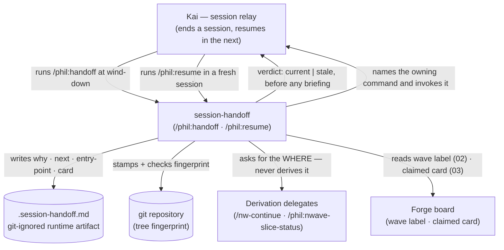
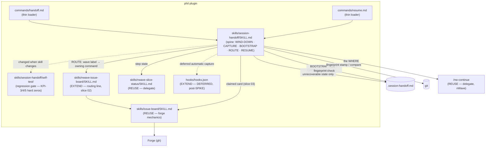

# Feature Delta — session-handoff

Forge: pmvanev/phil-claude-plugin#9 · Waves: DISCUSS ✓ · DESIGN ✓ · DISTILL ✓ (all 2026-08-12)
Deliverable type: `plugin` — verification is Gherkin + fixtures + dogfood, **not** pytest/Hypothesis.
Density: lean + ask-intelligent (`~/.nwave/global-config.json`)
Rendered Tier-2 expansion: `alternatives-considered` [WHY] — accepted 2026-08-12, trigger:
cross-context complexity (5 bounded contexts, threshold ≥3). Recorded here because this repo has no
`scripts/shared/telemetry.py`, so no `DocumentationDensityEvent` could be emitted.

---

## Wave: DISCUSS / [REF] Persona ID

**`kai-session-relay`** — Kai, a developer carrying multi-session AI-assisted work in a repo using
the phil plugin. Hands the baton from one session to the next, and is the one who pays when the
handoff drops.

**Registered in SSOT** at `docs/product/personas/kai-session-relay.yaml` (user-approved 2026-08-12).
No existing persona fit: Quinn owns invisible technical initiatives, Rowan wants an independent
adversary, Avery adjudicates qualitative evidence, Tess maintains tests. A new persona per feature is
this repo's established pattern (Tess ← refactor-tests, Devon ← ux-standards-rule, Quinn ← phil-work,
Avery ← edd-loop, Rowan ← adversarial-review).

Sibling to Quinn: Quinn wants discipline *within* an initiative, Kai wants continuity *across* the
session boundary that cuts through it.

## Wave: DISCUSS / [REF] JTBD one-liner

When a session ends mid-initiative, Kai wants the next session to resume with the reasoning, the
intended next action, and the right entry-point already in hand — so momentum survives the boundary
instead of being re-explained or freelanced away.

## Wave: DISCUSS / [REF] Locked decisions

- **[D1]** Feature type = **cross-cutting**. Rationale: spans session lifecycle (hooks), the forge
  board, local artifacts, `nw-continue`/`nwave-slice-status` interop, and entry-point routing.
  Matches `adversarial-review`'s classification rather than `phil-work`'s narrower
  infrastructure/tooling framing. (User, 2026-08-12)
- **[D2]** Walking skeleton = **yes**, slice 01. Rationale: 3-for-3 precedent in this repo
  (`phil-work` 5 slices, `edd-loop` 2, `adversarial-review` 3, slice 01 the WS in each), and the
  core shape is unsettled — a WS settles snapshot-vs-reconstruct empirically instead of by argument.
  (User, 2026-08-12)
- **[D3]** UX research depth = **comprehensive**. Rationale: the damaging failure mode
  (bootstrapping confidently from a stale snapshot) lives in the error path, which lightweight
  depth skips. (User, 2026-08-12)
- **[D4]** JTBD analysis = **yes** (not the infrastructure-only escape valve). Rationale: forced —
  the escape valve is permitted only for pure internal changes with no user-visible surface, and
  the reviewer rejects it for anything user-facing. This feature ships developer-invocable commands.
  (Forced by `nw-discuss` Decision 4)
- **[D5]** Five categories of lost state are in scope, including **the how**. Rationale: the user
  named a fifth category beyond the four proposed — a fresh session performing work inline that an
  nWave command or other entry-point should have driven. See *Scope Assessment* for the consequence.
  (User, 2026-08-12)

## Wave: DISCUSS / [REF] Job story

Registered against a **new** job — no job in `docs/product/jobs.yaml` covers it. Nearest neighbours
and why they do not:

| Existing job | Why it does not cover this |
|---|---|
| `deliver-invisible-work-with-discipline` (Quinn) | Owns discipline *within* one initiative; says nothing about the session boundary |
| `prove-qualitative-expectations-with-evidence` (Avery) | Proves intent was met; not about carrying state forward |
| `get-independent-adversarial-critique-of-completed-work` (Rowan) | Judges completed work; handoff is about incomplete work |

**Job story:**

> When a session ends mid-initiative — context exhausted, the day over, or compaction hit — I want
> the next session to pick up with the reasoning, the intended next action, and the correct
> entry-point already in hand, so I can keep momentum instead of re-explaining the state of play or
> watching a fresh agent freelance work that a command should have driven.

### The five categories of lost state

Ranked by whether a fresh session can recover them unaided — which is the whole design axis, because
anything recoverable that a snapshot also records becomes a second authority that can drift.

| # | Category | Recoverable from artifacts? | Who owns it today |
|---|---|---|---|
| 1 | **The why** — decisions made verbally, approaches tried and ruled out, why work stopped | **No.** Never written down anywhere | Nothing |
| 2 | **The how** — which command / skill / entry-point should drive the work | **No.** The card describes work, not method | Nothing (issue #10) |
| 3 | **The what-next** — the intended next action | Partly; guessing it wrong is worse than not guessing | `continue.md` PENDING section, by hand |
| 4 | **The board/queue position** — which card was claimed, and why it was next | The board knows the card's status, not which session claimed it | Board (partially) |
| 5 | **The where** — file, step, branch, commit | **Largely yes** | `/nw-continue`, `/phil:nwave-slice-status` — for nWave features only |

Category 5 is largely solved and must not be re-recorded. Categories 1 and 2 are unrecoverable by
any reconstruction, because they were never artifacts — that is the irreducible core of this feature.

### Dimensions

- **Functional** — Capture the state a fresh session cannot derive (the why, the how, the intended
  next action, the claimed card), surface it at session start, and route the session to the correct
  entry-point — without becoming a second authority over facts the artifacts already own.
- **Emotional** — Relief from re-explaining the state of play at the top of every session;
  confidence the next session resumes *correctly* rather than plausibly-but-wrongly; trust that a
  snapshot is either current or honestly says it is not.
- **Social** — A teammate, or a future self, can see what was in flight and why it stopped; being
  someone whose work gets picked up cleanly rather than restarted.

### Four forces

- **Push** — `continue.md` (108 lines) and `todo.md` (19 lines) are hand-maintained resume notes,
  both scoped to a single feature rather than a session, and both stale: the newest date in either
  is 2026-07-01 with roughly a dozen commits since. `/nw-continue` reconstructs only wave-managed
  nWave features. A fresh session performs work inline that a command should have driven. The *why*
  is never recorded anywhere at all.
- **Pull** — One command to put the session down and one to pick it up, such that resumption is not
  a re-briefing; and a card or snapshot that names the entry-point so the agent routes instead of
  freelancing.
- **Anxiety** —
  - **(A)** A snapshot the human must remember to update goes stale silently, and a stale handoff is
    *worse than none* because the next session trusts it. This is the force the design is built
    against — it is the observed failure of `continue.md`, not a hypothetical.
  - **(B)** Two authorities over the same state (a local file and the board) drift. `phil:issue-board`
    already forbids exactly this under *One system of record per scope*.
  - **(C)** Session scratch published to a board is visible to everyone who reads the board.
  - **(D)** Ceremony on work that did not need it — the anxiety `phil:work` (B) and `edd` (B) both
    carry, countered there by an off-ramp.
- **Habit** — Hand-writing `continue.md`; re-explaining state in the first prompt of each session;
  letting the agent start freelancing and correcting it mid-flight.

### Opportunity score

`not-scored` — single new job, priority by default. Consistent with every prior job in
`docs/product/jobs.yaml`.

## Wave: DISCUSS / [REF] Scope Assessment

**Verdict: OVERSIZED — 2 signals fired. A split is required before Phase 2 journey investment.**

| Signal | Fired? | Evidence |
|---|---|---|
| >3 bounded contexts or modules | **YES** | Five: session lifecycle/hooks · forge board · local artifacts · nWave interop (`nw-continue`, `nwave-slice-status`) · entry-point routing |
| Multiple independent user outcomes that could ship separately | **YES** | Three: (a) capture and restore the why + next action; (b) route the session to the correct entry-point; (c) link a session to a claimed board card |
| >10 user stories | not established | Stories not yet drafted — not claimed as a signal |
| WS needs >5 integration points | no | The thinnest path touches a file and a session boundary |
| Effort >2 weeks | not established | Plausible, but no reference class measured — not claimed |

Two signals is the threshold, so this is oversized on evidence rather than on a hunch. Precedent:
`phil-work` fired 4 signals and split into 5 slices.

### Consequence for issue #10

Outcome (b) — routing the session to the correct entry-point — **is** issue #10. Because D5 puts
"the how" inside this job, #10 is no longer cleanly separable as a standalone board issue: it is one
of this feature's independent outcomes, which under `phil:nwave-issue-board`'s mapping makes it a
**slice of this feature**, not a sibling issue.

This reverses the reasoning used to file it separately, and the reversal is a decision for Phase 2.5
slicing, not for now. Both readings are still live:

- **Fold in** — #10 becomes a slice card under #9, so one design covers card-side and session-side
  routing and they cannot contradict each other.
- **Keep separate** — #10 ships a one-line fix to a shipped skill without waiting on this feature's
  DISCUSS wave; the standalone-fix argument that justified filing it has not weakened.

Recorded here so the decision is made deliberately at slicing rather than defaulted into.

## Wave: DISCUSS / [REF] Journey

SSOT: `docs/product/journeys/session-handoff.yaml`. Comprehensive depth per D3.

**Happy path:** wind-down → capture → bootstrap → route → resume.

**Emotional arc:** pressured → relief → cautious confidence → trust → momentum (upward).

**The two load-bearing design rules**, both derived from the anxieties rather than from taste:

- **Freshness is a verdict, not a footnote.** Read-back computes `current` / `stale` from a tree
  fingerprint and states it *before* presenting any resume content. Anxiety A is gated here.
- **The `where` is deliberately not a shared artifact.** File, step, and branch are derived at
  read-back from the artifacts that own them. Carrying them in the snapshot would create the second
  authority anxiety B forbids.

Eight error paths are mapped in the SSOT journey. The three that shape the design: a stale
fingerprint refuses to resume silently; a session that advanced nothing writes no snapshot; an
undeterminable entry-point is stated and asked about, never defaulted to inline work.

## Wave: DISCUSS / [REF] Slices and order

Three slices, one per independent outcome from the scope assessment. Briefs in
`docs/feature/session-handoff/slices/`. All carpaccio taste tests pass — recorded per brief.

| # | Slice | Learning hypothesis — disproves… | Depends on |
|---|---|---|---|
| 01 | Snapshot and resume (**WS**) | …that recording beats reconstructing | — |
| 02 | Entry-point routing (absorbs #10) | …that a written instruction is sufficient | 01 (session-side half only) |
| 03 | Claimed-card link | …that the board already carries enough | 01 |

**Order rationale** — highest learning leverage first, per the Phase 2.5 rule:

1. **Slice 01** tests the feature's central bet. If recording does not beat reconstructing, the whole
   design pivots, and every later slice consumes its snapshot format — so a failure here is cheapest
   first.
2. **Slice 02** removes a correction the user currently repeats on every nWave pickup, and its
   card-side half can ship without slice 01 if that slips.
3. **Slice 03** is the most mechanical and tests the narrowest claim against the surface (the board)
   most likely to already cover it.

Each slice carries a same-day dogfood moment against this repo's real state — a real commit SHA, the
genuinely stale `continue.md`, and the live board including its real two-cards-In-Progress condition.

## Wave: DISCUSS / [REF] Driving ports

Inbound surfaces, provisional until the mechanism is settled in Phase 2:

- **Slash command(s)** — the snapshot and bootstrap entry points, whatever their final shape
  (two commands, one command with two modes, or a mode on an existing command).
- **Session lifecycle hooks** — a candidate, not a commitment: `Stop`, `SessionEnd`, or `PreCompact`.
  Anything requiring the user to remember to snapshot inherits `continue.md`'s staleness failure
  (anxiety A), which is the argument for a hook; the argument against is that a hook fires on every
  session end whether or not there was anything worth recording.

## Wave: DISCUSS / [REF] WS strategy

**Provisional: Strategy C (real local resources) if the snapshot target is local; Strategy B (real
local + fake costly) if it writes to the forge.** Per Mandate 5 the WS adapter strategy is the DISTILL
acceptance designer's auto-detected call with user confirmation — not a DISCUSS decision — so this is
recorded as a read, not a ruling.

The fork is real: filesystem and git are real-adapter-always per the Mandate 5 resource table, but
`gh`/`glab` is an external network dependency that the WS should not depend on, which pushes toward a
faked forge adapter plus a contract test.

Brownfield incremental (additive), as with every prior feature here: the plugin exists and this is
added alongside it. Not the env-switching configurable strategy — no expansion trigger fired.

## Wave: DISCUSS / [REF] Pre-requisites

- **None blocking.** No prior DISCOVER or DIVERGE wave ran for this feature
  (`docs/feature/session-handoff/` did not exist before this wave).
- `docs/product/jobs.yaml`, `docs/product/architecture/brief.md`, and the four existing personas were
  read as SSOT input. `docs/product/vision.md`, `docs/project-brief.md`, and `docs/stakeholders.yaml`
  do not exist in this repo.
- **SSOT writes pending confirmation** of the job story above: a new job in `jobs.yaml`, a new
  `personas/kai-session-relay.yaml`, and a new `journeys/session-handoff.yaml`.

## Wave: DISCUSS / [REF] User stories

All three carry `job_id: carry-work-across-session-boundaries`. All three are user-visible value
stories — **no slice is `@infrastructure`-only**, so the slice-composition hard gate passes.

**Command names below are provisional.** Whether this is two commands, one command with two modes, or
a mode on an existing command is an open DESIGN question (see *Driving ports*). The pitches are
restated if that changes; what they pin is the observable output, not the spelling.

### Story 1 — Snapshot and resume (slice 01, WS)

As Kai, I want to record what a fresh session cannot derive and read it back with a freshness verdict,
so resuming is not a re-briefing.

#### Elevator Pitch
Before: when a session ends mid-initiative, the reasoning and the intended next action exist only in
that session; the next one needs a re-briefing.
After: run `/phil:handoff` → sees `snapshot written · 3 decisions · next: <action> · fingerprint a1b2c3d`;
then in a fresh session run `/phil:resume` → sees `current`, or
`stale — HEAD moved a1b2c3d → e4f5g6h`, followed by the why and the next action.
Decision enabled: whether to trust the resume point and continue, or discard it and reconstruct from
artifacts.

### Story 2 — Entry-point routing (slice 02)

As Kai, I want a card and a resume point to name the command that owns the work, so a fresh session
routes instead of freelancing.

#### Elevator Pitch
Before: picking up a card, the agent reads a work description and starts doing the work inline; the
user has to say "use the nWave skill" on every pickup.
After: run `/phil:resume` on a wave-labelled feature → sees `owner: /nw-execute (wave: deliver)` and the
session invokes it rather than editing files directly.
Decision enabled: whether the work is being driven by the command that owns it, without having to
police it.

### Story 3 — Claimed-card link (slice 03)

As Kai, I want the claimed card and the basis for it being next carried across the boundary, so
resumption targets the same card.

#### Elevator Pitch
Before: the board records that a card is In Progress but not which session claimed it or why it was
next — two cards can sit In Progress with no record of which is live.
After: run `/phil:resume` → sees `card: #11 · basis: WS, everything depends on its snapshot format`,
plus `competing claim: <other snapshot>` when one exists.
Decision enabled: whether to resume the same card or deliberately switch.

Acceptance criteria are embedded per slice brief in `docs/feature/session-handoff/slices/` rather than
restated here — one authority per fact.

## Wave: DISCUSS / [REF] Outcome KPIs

| # | KPI | Target | Measurement |
|---|---|---|---|
| KPI-1 | Resumes needing a clarifying question the snapshot should have answered | **<20%** over the first 10 real resumes | Counted by hand during dogfooding; this is slice 01's hypothesis made numeric |
| KPI-2 | Pickups where the user must say "use the nWave skill" | **0** across 5 consecutive nWave pickups | Counted by hand; slice 02's hypothesis made numeric |
| KPI-3 | Resumes that proceed on a stale snapshot without stating staleness | **0 — hard** | Self-test fixture: stale fingerprint must produce a `stale` verdict before any briefing |
| KPI-4 | No-op sessions that write a snapshot anyway | **0** | Self-test fixture: session that advanced nothing writes nothing (anxiety D) |
| KPI-5 | Facts duplicated between the snapshot and an artifact that owns them | **0** | Review of the snapshot schema against the five-category table; the *where* must be absent |

KPI-3 and KPI-5 are the two that encode the anxieties rather than the features, which is why both are
hard zeros and both are fixture-measured rather than counted by hand.

## Wave: DISCUSS / [REF] Definition of Ready — validation

| # | DoR item | Status | Evidence |
|---|---|---|---|
| 1 | Job traceable | ✅ | New job `carry-work-across-session-boundaries` in `jobs.yaml`; all 3 stories carry it |
| 2 | Persona defined | ✅ | `personas/kai-session-relay.yaml` |
| 3 | Journey mapped | ✅ | `journeys/session-handoff.yaml` — 5-step happy path + 8 error paths |
| 4 | Stories have elevator pitches | ✅ | All 3, with observable output; command names flagged provisional |
| 5 | ACs testable | ✅ | Given-When-Then per slice brief, fixture-checkable, pinned to real repo state |
| 6 | Slices ≤1 day, learning hypothesis each | ✅ | 3 briefs; all carpaccio taste tests recorded per brief |
| 7 | Walking skeleton identified | ✅ | Slice 01 — snapshot + read-back, end-to-end, forge deliberately excluded |
| 8 | Outcome KPIs with targets | ✅ | KPI-1…5; two are hard zeros and fixture-measured |
| 9 | Scope right-sized / split confirmed | ✅ | OVERSIZED on 2 signals; 3-slice split confirmed by user 2026-08-12 |

**Requirements completeness: 0.95.** Stated with its residue named so the number is auditable rather
than asserted. Specified: what state is captured, what must not be captured, what verdict is required
before a briefing, what must never happen (KPI-3/4/5), and the error paths for every high-risk step.
Deferred, all mechanism rather than requirement:

- Snapshot surface — local file, board, or both partitioned by scope (DESIGN)
- Trigger — explicit command versus lifecycle hook (DESIGN; slice 01 uses explicit invocation so this
  cannot block the WS)
- Command topology — two commands, one with two modes, or a mode on an existing command (DESIGN)

One genuine **requirements-level** gap, carried from the absorbed issue: whether a card with **no** wave
label gets a routing line at all. Slice 02 covers only the wave-labelled case, and most cards on this
board are not nWave work.

**Per-wave peer review: skipped**, per the skill's default. None of the four triggers fired — the DoR
surfaced no ambiguity, the JTBD was user-confirmed, there is no vendor-neutrality surface, and no
review was requested. The mandatory consolidated review fires at the end of DISTILL with all waves
visible.

## Wave: DISCUSS / [REF] Out-of-scope

Provisional — firmed up in Phase 3.

- **Re-recording what artifacts already own.** Category 5 (the where) is `/nw-continue`'s and
  `/phil:nwave-slice-status`'s; this feature does not duplicate it.
- **Syncing a local file with the board.** Forbidden by `phil:issue-board` *One system of record per
  scope*. If both surfaces end up carrying state, they partition by scope with the issue number as
  the only join.
- **Writing back to `docs/feature/`** from a forge issue. `phil:nwave-issue-board` is one-way.
- **Cross-session concurrency control.** Multiple simultaneous sessions are routine in this repo
  (workflows, subagents); arbitrating between two live sessions' snapshots is a separate problem and
  is not solved here.

## Wave: DISCUSS / [WHY] Alternatives considered

Tier-2 expansion. What was weighed and rejected per locked decision — and, for the three questions
DESIGN inherits, the state of the argument rather than a verdict, because those are not settled.

### Per locked decision

**[D1] Feature type — cross-cutting**

| Alternative | Why rejected |
|---|---|
| infrastructure/tooling (`phil-work` D1 verbatim) | Accurate for a single tactical command. This one spans five contexts and interoperates with two existing reconstruction commands plus the board — and classifying it narrowly would have *hidden* the bounded-context signal that later fired OVERSIZED. The classification is load-bearing, not cosmetic. |
| user-facing | Truest to the literal option list, since the developer is the end user. Rejected for consistency: every prior developer-invoked command here is infrastructure or cross-cutting, and the classification sets DESIGN's expectations about what "user" means. |

**[D2] Walking skeleton — yes, slice 01**

| Alternative | Why rejected |
|---|---|
| "Depends — evaluate first" | The literally-correct answer for brownfield. Costs a round trip to reach a conclusion that 3-for-3 precedent (`phil-work`, `edd-loop`, `adversarial-review`) already predicts. |
| No skeleton | The core shape is unsettled. A WS settles record-vs-reconstruct empirically; without one, that question gets decided by argument, which is how a wrong premise survives to DELIVER. |

**[D3] Depth — comprehensive**

| Alternative | Why rejected |
|---|---|
| Lightweight | Skips error-path mapping. The failure that does real damage — a stale snapshot trusted — *is* an error path, so lightweight would have designed around the happy case only. |
| Deep-dive | One developer, one repo, one persona. Every prior persona here was bootstrapped from a single feature; multi-persona research has nothing to consume it. |

**[D4] JTBD — yes.** No alternative existed. The escape valve is structurally unavailable to a feature
shipping developer-invocable commands, and the reviewer rejects it for any user-facing surface. Recorded
as forced rather than chosen, so DESIGN does not read it as a considered judgment.

**[D5] Five categories including "the how."** The rejected alternative was my own: four categories, with
"the how" left outside the job as standalone issue #10. The user's answer overturned it. Worth recording
because the consequence was structural, not cosmetic — it converted #10 from a sibling issue into one of
three independent outcomes, and therefore into a slice.

**[D6] Three slices**

| Alternative | Why rejected |
|---|---|
| 4 slices — staleness split out | Would ship a walking skeleton whose snapshot carries a timestamp but no staleness verdict. That skeleton exhibits the exact failure the feature exists to fix (`continue.md`), so the WS would validate the wrong thing. Staleness stays inside slice 01 as AC 3. |
| 2 slices — board link folded into 01 | Pulls the forge into the walking skeleton, forcing WS strategy from C (real local) to B (faked forge adapter). A thicker skeleton bought for the *least* uncertain of the three outcomes. |

**[D7] #10 folded in.** The standalone argument — a one-line fix to a shipped skill should not wait on a
DISCUSS wave — was sound while "the how" sat outside the job, and D5 removed that premise rather than
refuting the argument. It survives in slice 02's dependency split: the card-side half is independent of
slice 01 and can land first.

### The three questions DESIGN inherits

Not decisions. Alternatives with the argument recorded so DESIGN does not re-derive it.

**Snapshot versus reconstruct** — the feature's central bet.

- **Reconstruct-only** (extend `/nw-continue`): structurally cannot go stale, because the artifacts *are*
  the truth. Fatal limit: it cannot recover what was never an artifact. The why and the how were never
  written anywhere, so no amount of scanning finds them. **Not rejected** — it is slice 01's null
  hypothesis, and if the WS resumes cleanly without the snapshot, the feature pivots here.
- **Record-only**: rejected as a whole-design stance, because recording the *where* alongside the why
  creates the second authority anxiety B forbids.
- **Hybrid — record the unrecoverable, derive the rest**: the posture the five-category table encodes,
  and what slice 01 actually tests.

**Local file versus board**

- **Board-only**: rejected for in-flight scratch — the board is world-readable (anxiety C). Not rejected
  for the outward-facing tier.
- **Local-only**: chosen *for the walking skeleton specifically*, to keep the forge out of it. This is a
  WS-scoping choice, not a verdict on the feature.
- **Both, partitioned by scope**: the likely end state, and the shape `phil:issue-board` already
  prescribes — local owns in-flight detail, the forge owns what others see, the issue number is the only
  join. Nothing duplicated means nothing can drift.

**Explicit command versus lifecycle hook**

- **Explicit command**: inherits `continue.md`'s failure directly — anything the human must remember to
  run is something they will stop running. That is the observed failure, not a predicted one.
- **Hook** (`Stop` / `SessionEnd` / `PreCompact`): fires whether or not anyone remembers, but fires on
  *every* session end including ones that advanced nothing — countered by constraint C4 (no snapshot for
  a no-op). The open unknown is whether a hook sees enough context to capture the why at all, which is
  exactly the conditional SPIKE in slice 01's brief.
- Slice 01 uses explicit invocation deliberately, so this unknown cannot block proving the payload.

## Wave: DISCUSS / [REF] Wave decisions summary

For DESIGN to read first.

### Key decisions

- **[D1]** Feature type: cross-cutting — spans session lifecycle, forge board, local artifacts, nWave
  interop, entry-point routing.
- **[D2]** Walking skeleton: slice 01 — snapshot + read-back, forge deliberately excluded to keep the
  skeleton on real local resources.
- **[D3]** UX depth: comprehensive — the damaging failure mode lives in the error path.
- **[D4]** JTBD: mandatory (forced; user-facing surface).
- **[D5]** Five categories of lost state, including **the how**, which absorbed issue #10 into slice 02.
- **[D6]** Scope OVERSIZED on 2 signals → 3 slices, one per independent outcome. User-confirmed.
- **[D7]** Issue #10 folded in as slice 02 rather than kept standalone. User-confirmed; the
  counter-argument and the card-side/session-side dependency split preserve the original speed argument.

### Requirements summary

- **Primary job:** carry the state a fresh session cannot derive across the session boundary — the why,
  the how, the next action, the claimed card — while deriving everything the artifacts already own.
- **Walking skeleton scope:** slice 01 — capture the why + next action locally with a tree fingerprint,
  read it back with a `current`/`stale` verdict.
- **Feature type:** cross-cutting; target artifacts are prose-first (commands, skills, possibly hooks),
  consistent with every prior feature in this plugin.

### Constraints established

- **C1 — Freshness is a verdict, not a footnote.** A `current`/`stale` verdict precedes any resume
  content. A confidently-followed stale snapshot is the worst available outcome, and it is the observed
  failure of `continue.md`, not a hypothetical.
- **C2 — One system of record.** Nothing an artifact owns is copied into the snapshot; the *where* is
  derived at read-back. Forbidden by `phil:issue-board` *One system of record per scope*.
- **C3 — The projection stays one-way.** Nothing read from a forge issue is written back into
  `docs/feature/`, per `phil:nwave-issue-board`.
- **C4 — No ceremony on a no-op.** A session that advanced nothing writes no snapshot.
- **C5 — Unknown owner is stated, never defaulted.** No determinable entry-point means asking, not
  falling through to inline work.
- **C6 — Detection without resolution is an acceptable boundary.** Competing claims are reported;
  arbitrating between two live sessions is out of scope for v1.

### Upstream changes

None. No DISCOVER or DIVERGE wave ran for this feature, so no prior assumption was altered.

### Downstream note for DESIGN

Three mechanism questions are deliberately left open and are DESIGN's to settle: the snapshot surface
(local / board / partitioned), the trigger (command / lifecycle hook), and the command topology. Slice
01 is specified so that none of them blocks the walking skeleton. Separately, the wave → command table
in slice 02 is assembled from command descriptions and **must be verified against a run** before it is
written into a skill.

---

# Wave: DESIGN (entered 2026-08-12)

Scope: application / components · Mode: propose · Architect lens: `nw-solution-architect`
(worked inline rather than dispatched as a subagent, at the user's standing instruction).

## Wave: DESIGN / [REF] DDD list

- **[DDD-1]** Snapshot surface = **a git-ignored root dotfile, `.session-handoff.md`**. Reuses the
  `.refactor-loop-ledger.md` convention. Deliberately breaks ADR-006/ADR-009's committed lean, because
  a per-session snapshot has concurrent writers where a per-initiative trail has one. → ADR-013
- **[DDD-2]** Trigger = **explicit command in v1; `Stop`/`SessionEnd` hook deferred past slice 01**.
  Hook infrastructure already fires in this plugin; what is unproven is whether a hook can see the
  *why*. → ADR-014
- **[DDD-3]** Topology = **two commands**, `/phil:handoff` and `/phil:resume`. Capture and read-back
  happen at opposite ends of a session with opposite effects; a single command would need an implicit
  disambiguation rule, and implicit state is what this feature exists to remove. → ADR-014
- **[DDD-4]** Reuse = **CREATE NEW spine, REUSE by delegation**. `/phil:work`, `/nw-continue`, and
  `/phil:nwave-slice-status` are composed unchanged. → ADR-014
- **[DDD-5]** The spine **never derives** what another component owns. The snapshot records only the
  unrecoverable; everything else is fetched from its owner at read-back. This makes DISCUSS anxiety B
  structural rather than a matter of discipline.
- **[DDD-6]** Pattern = **modular prose skill, ports-and-adapters** — the lineage of every prior
  feature here (`refactor-tests` → `phil-work` → `edd-loop` → `adversarial-review`).
- **[DDD-7]** Paradigm = **not declared**. The deliverable is prose (skill + commands) with Bash
  adapters. No prior feature wrote a `## Development Paradigm` section to `CLAUDE.md`, and this one
  gives no reason to start.

## Wave: DESIGN / [REF] Component decomposition

| Component | Path | Change |
|---|---|---|
| Capture command | `commands/handoff.md` | **CREATE NEW** — thin loader |
| Read-back command | `commands/resume.md` | **CREATE NEW** — thin loader |
| Spine | `skills/session-handoff/SKILL.md` | **CREATE NEW** — WIND-DOWN · CAPTURE · BOOTSTRAP · ROUTE · RESUME |
| Regression gate | `skills/session-handoff/self-test/` | **CREATE NEW** — fixtures, incl. the KPI-3/4/5 hard zeros |
| Runtime artifact | `.session-handoff.md` (repo root) | **CREATE NEW** — git-ignored, per ADR-013 |
| Ignore rule | `.gitignore` | **EXTEND** — one line, beside `.refactor-loop-ledger.md` |
| Card-side routing line | `skills/nwave-issue-board/SKILL.md` | **EXTEND** — slice 02 only; the sole planned edit to an existing skill |
| Session-end automation | `hooks/hooks.json` | **EXTEND — DEFERRED** past slice 01, gated on the SPIKE |

## Wave: DESIGN / [REF] Driving ports

| Port | Surface | Slice |
|---|---|---|
| `/phil:handoff` | Slash command — capture at wind-down | 01 |
| `/phil:resume` | Slash command — read back at session start | 01 |
| `Stop` / `SessionEnd` hook | Lifecycle event — automatic capture | deferred, post-SPIKE |

## Wave: DESIGN / [REF] Driven ports and adapters

| Driven port | Adapter | Notes |
|---|---|---|
| Snapshot store | Filesystem via Bash — `.session-handoff.md` | Real local resource; WS strategy C |
| Tree fingerprint | `git rev-parse HEAD` + porcelain dirty-state, via Bash | The staleness oracle (C1) |
| nWave feature position | **Delegate** `/nw-continue` | Unmodified; owns the *where* |
| Slice step state | **Delegate** `/phil:nwave-slice-status` | Unmodified; read-only by design |
| Entry-point resolution | Wave label on the feature issue, via `phil:nwave-issue-board` | Slice 02; live label beats recorded |
| Claimed card | Forge read via `gh`, per `phil:issue-board` | Slice 03; external dependency → WS strategy B if pulled earlier |

## Wave: DESIGN / [REF] Technology choices

| Choice | Pin | Rationale |
|---|---|---|
| Substrate | Prose skill + thin command loaders (markdown) | The plugin's established shape; no runtime added |
| Adapters | Bash (git, filesystem) | Real local resources per Mandate 5's table |
| Forge client | `gh` 2.97.0 | Already the plugin's verified client; slices 02–03 only |
| Hooks | Python, `hooks/hooks.json` | Matches the existing `refactor-loop` G2 guard; deferred |
| Snapshot format | Markdown with a delimited, machine-readable header | Human-readable at rest; fingerprint parseable without a parser dependency |

## Wave: DESIGN / [REF] Reuse Analysis

Hard gate. Every component with overlapping responsibility, classified.

| Existing component | File | Overlap | Decision | Justification |
|---|---|---|---|---|
| `/phil:work` no-arg resume | `skills/work/SKILL.md:48` | Resumes an interrupted multi-step run from `progress.md` | **CREATE NEW** | Coupling, not complexity: extending it makes `phil:work` own continuity for nWave and ad-hoc work it never launched, inverting ADR-005's delegate-and-inherit arrow. Coverage settles it independently — only `phil:work` initiatives have a `progress.md`, so extending covers ~⅓ of cases and still needs a second mechanism, which is anxiety B. Pattern reused, component not. |
| `/nw-continue` | nWave skill | Reconstructs an nWave feature's position from artifacts | **REUSE (delegate)** | Owns the *where*. Delegated unmodified; re-deriving it here would create the second authority DDD-5 forbids. |
| `/phil:nwave-slice-status` | `skills/nwave-slice-status/SKILL.md` | Derives a slice's step state | **REUSE (delegate)** | Same rule `nwave-issue-board` already follows: never derive a status, ask its owner. |
| `phil:nwave-issue-board` generated block | `skills/nwave-issue-board/SKILL.md` | Publishes per-feature state to a card | **EXTEND** | Slice 02's routing line belongs inside the existing delimited, timestamped block — it inherits generated-not-typed, so it cannot drift. ~1 line + 1 fixture versus a new publishing path. |
| `phil:issue-board` | `skills/issue-board/SKILL.md` | Forge mechanics, card status and position | **REUSE (unchanged)** | Already the mechanics owner; slice 03 reads through it. |
| `.refactor-loop-ledger.md` | `.gitignore` | Git-ignored root-dotfile runtime artifact | **REUSE (convention)** | ADR-013 adopts this exact shape rather than minting a fourth `docs/*/` namespace. |
| `hooks/hooks.json` `Stop` entry | `hooks/hooks.json` | Session-end triggering | **EXTEND (deferred)** | Infrastructure proven and firing; the open question is payload visibility, not mechanism. |
| `continue.md`, `todo.md` | repo root | Hand-written resume notes | **NEITHER** | Artifacts, not components — they are the failure being replaced. Subsuming them is out of scope per DISCUSS. |

Zero unjustified CREATE NEW decisions. The single CREATE NEW carries a coupling argument plus
independent coverage arithmetic, per the gate's evidence standard.

## Wave: DESIGN / [REF] C4 — System Context

## Wave: DESIGN / [REF] C4 — Container

## Wave: DESIGN / [REF] Decisions table

| # | Decision | ADR |
|---|---|---|
| DDD-1 | Snapshot surface = git-ignored root dotfile `.session-handoff.md` | ADR-013 |
| DDD-2 | Trigger = explicit command in v1; hook deferred past slice 01 | ADR-014 |
| DDD-3 | Topology = two commands | ADR-014 |
| DDD-4 | CREATE NEW spine; REUSE by delegation | ADR-014 |
| DDD-5 | The spine never derives what another component owns | ADR-014 |
| DDD-6 | Modular prose skill, ports-and-adapters | — (plugin lineage) |
| DDD-7 | Paradigm not declared | — (precedent) |

## Wave: DESIGN / [REF] Open questions

Deferred deliberately, with the wave that owns each.

- **→ DISTILL** — WS adapter strategy confirmation. DDD-1 keeps the forge out of slice 01, so the read
  is **Strategy C (real local)**; Mandate 5 makes this DISTILL's auto-detected call with user
  confirmation, not DESIGN's ruling.
- **→ DELIVER** — per-repo versus per-worktree snapshot. `EnterWorktree` and workflow isolation can put
  several trees on one initiative; ADR-013 records this unresolved.
- **→ DELIVER** — the wave → command table in slice 02 is assembled from command descriptions and
  **must be verified against a run** before it is written into a skill.
- **→ DELIVER** — snapshot schema detail: exactly which fields are structured versus prose. The
  constraint is fixed (record only the unrecoverable); the encoding is not.
- **Carried, unowned** — cards with **no** wave label. Slice 02 covers only the wave-labelled case,
  and most cards on this board are not nWave work. This is the DISCUSS requirements-level gap, still
  open after DESIGN.
- **Vacuous gate** — the Outcome Collision Check exited 0 against an empty registry
  (`docs/product/outcomes/registry.yaml` does not exist). Passing on zero outcomes is not evidence of
  no collision, and is recorded as such rather than as a clean gate.

## Wave: DESIGN / [REF] Wave decisions summary

### Architecture summary

- **Pattern:** modular prose skill, ports-and-adapters
- **Paradigm:** not declared (prose-first deliverable)
- **Key components:** `skills/session-handoff/SKILL.md` spine · two thin command loaders ·
  `.session-handoff.md` runtime artifact · self-test regression gate

### Constraints established

- **C7 — The snapshot is never committed.** It is runtime state; committing it converts a concurrency
  problem into a merge conflict on the resume path, and dirties the tree its own fingerprint reads.
- **C8 — Nothing derivable is recorded.** Every fact with an owner is fetched from that owner at
  read-back. This is anxiety B made structural.
- **C9 — No existing skill changes in slice 01.** `nwave-issue-board` is extended in slice 02 and
  nothing else is touched.

### Upstream changes

None. DESIGN settled the three questions DISCUSS deferred without altering any DISCUSS assumption;
all three were recorded as open rather than as decisions, so no back-propagation is required.

---

# Wave: DISTILL (entered 2026-08-12)

Deliverable type: **`plugin`** · Policy: `inherit` · Scenario SSOT:
`skills/session-handoff/acceptance.feature`

## Wave: DISTILL / [REF] Wave-decision reconciliation

**Reconciliation passed — 0 contradictions.** DISCUSS D1–D7 checked against DESIGN DDD-1–DDD-7. No
DEVOPS wave ran.

The three items DISCUSS left open (surface, trigger, topology) were recorded there **as open**, so
DESIGN settling them is resolution rather than contradiction, and no back-propagation is owed. The
prior waves' `wave-decisions.md` files do not exist as separate artifacts under `discuss/` and
`design/` — this repo uses the single-narrative convention, so the reconciliation was run against the
`## Wave: … / [REF] Wave decisions summary` sections of `feature-delta.md`.

## Wave: DISTILL / [REF] Deliverable type

**`plugin`**, resolved through the documented precedence: `.nwave/des-config.json` is **absent**;
`~/.nwave/global-config.json` declares no `defaults.deliverable_type`; so resolution falls to step 3,
root-only FS detection, and `.claude-plugin/plugin.json` at the root makes this a plugin.

This is the wave's most consequential routing fact, because the `plugin` type explicitly directs
verification away from the pytest/Hypothesis machinery that dominates this skill:

| | Applies here |
|---|---|
| `@nw-plugin-validator` + `@nw-skill-reviewer` | yes — the type-specific verification |
| Behavioural Gherkin scenarios | yes — `acceptance.feature`, business language only |
| Example-interaction evidence | yes — same-day dogfood, captured verbatim |
| pytest / Hypothesis / PBT / state-delta `Universe` | **no** — "NOT pytest/Hypothesis-centric" |

**Recommendation:** pin `deliverable_type: plugin` in `.nwave/des-config.json`. The skill requires the
routing and the runtime enforcement gate to read the *same* source, and today neither reads anything —
both re-derive it. Note that `.gitignore` excludes `.nwave/*` except `local-config.json`, so a pinned
value would be machine-local unless that rule is amended.

## Wave: DISTILL / [REF] Scenario list

Ten scenarios, ten golden fixtures, one-to-one. `skills/session-handoff/self-test/`.

| # | Scenario | Tags | Outcome |
|---|---|---|---|
| 01 | A session hands its reasoning to the next one | `@walking_skeleton @driving_port @real-io @slice-01` | `CAPTURE` → `RESUME-CURRENT` |
| 02 | A session that achieved nothing leaves nothing behind | `@slice-01 @error` | `NO-OP` |
| 03 | The resume point refuses to duplicate what is recorded elsewhere | `@slice-01 @error` | `REFUSE-DERIVABLE` |
| 04 | A resume point that no longer matches says so before anything else | `@slice-01 @error @real-io` | `RESUME-STALE` |
| 05 | With no resume point, what is reconstructed is labelled so | `@slice-01 @error` | `RECONSTRUCT` |
| 06 | Work is handed to whatever owns it | `@slice-02 @driving_port` | `ROUTE` |
| 07 | A recorded owner that has since changed does not win | `@slice-02 @error` | `ROUTE-LIVE-WINS` |
| 08 | An unknown owner is admitted, never guessed | `@slice-02 @error` | `ASK-OWNER` |
| 09 | The next session resumes the same work, for the same reason | `@slice-03` | `CAPTURE` + claim |
| 10 | Two sessions claiming the same work is reported | `@slice-03 @error` | `REPORT-CLAIM-CONFLICT` |

**Error/edge coverage: 7 of 10 (70%)**, against the ≥40% target. That ratio is not padding — six of
the seven pin a *silent* failure, where the wrong behaviour is indistinguishable from success without
the fixture.

Exactly one `@walking_skeleton` scenario (01), green before hand-off is claimed.

## Wave: DISTILL / [REF] Port treatment — replacing the A/B/C/D strategy

DESIGN handed DISTILL an open question: "confirm WS adapter strategy; the read is Strategy C."
**That mechanism no longer exists.** `nw-distill` retires the per-feature A/B/C/D choice and replaces
it with port-class → treatment defaults plus a per-project Infrastructure Policy. Existing features
naming a strategy remain valid as historical record; new features express the same intent structurally.

So the answer to DESIGN's question is a correction, not a confirmation. The intent DESIGN meant by
"Strategy C — real local resources" survives intact:

| Port | Class | Treatment | Mechanism |
|---|---|---|---|
| `/phil:handoff`, `/phil:resume` | Driving | Real | Golden fixture + dogfood through the real invocation path |
| `.session-handoff.md` | Driven internal | Real | Real files in a throwaway dir |
| git fingerprint | Driven internal | Real | Real `git` in a throwaway repo |
| Forge (`gh`) | Driven external | Fake | Board state supplied by `manifest.json` |
| `/nw-continue`, `/phil:nwave-slice-status` | Driven external | Fake | Delegate result supplied by `manifest.json` |

Policy written to `docs/product/architecture/atdd-infrastructure-policy.md` — placed under the repo's
existing architecture root rather than the skill's suggested `docs/architecture/`, per project
convention.

## Wave: DISTILL / [REF] Adapter coverage (Mandate 6)

| Adapter | Real-I/O scenario | Covered by |
|---|---|---|
| Filesystem — snapshot write/read | YES | 01 (`@real-io`), 02 (asserts absence) |
| Git — tree fingerprint | YES | 04 (`@real-io`, real commit range `11def92 → 2baad65`) |
| Forge — wave label | fake | 06, 07 — board state in `manifest.json`; live board covered by dogfood |
| Forge — card status | fake | 09, 10 — same |
| `/nw-continue` delegate | fake | 05 — delegate result in `manifest.json` |
| `/phil:nwave-slice-status` delegate | fake | 05 — same |

Zero `NO — MISSING` rows. The four fakes are driven-external per the policy, and each is additionally
exercised for real during that slice's same-day dogfood — which is the example-interaction evidence the
`plugin` deliverable type requires.

## Wave: DISTILL / [REF] Scaffolds (Mandate 7, adapted)

Mandate 7 exists so tests fail **RED** (behaviour missing) rather than **BROKEN** (harness faulty), and
prescribes stub modules with `__SCAFFOLD__` markers so imports resolve.

**No scaffolds are needed here, and none were written.** The fixtures are prose inputs with no imports
to resolve, so there is no BROKEN failure mode available to them. All ten fail today because
`skills/session-handoff/SKILL.md` does not exist — the behaviour is unimplemented, which is genuine RED
by Mandate 7's own definition. This matches `edd` and `adversarial-review`, whose fixtures were likewise
authored in DISTILL against a `SKILL.md` built in DELIVER.

Consequently `docs/feature/session-handoff/distill/red-classification.md` is not produced: every
scenario's classification is `MISSING_FUNCTIONALITY`, uniformly and by construction.

## Wave: DISTILL / [REF] Driving adapter coverage

DESIGN names two driving ports and one deferred. Each needs a scenario exercising its real invocation
path, not an internal call:

| Driving port | Scenario | Exercised how |
|---|---|---|
| `/phil:handoff` | 01, 02, 03, 09 | Invoked as the command, at wind-down |
| `/phil:resume` | 01, 04, 05, 06, 07, 08, 10 | Invoked as the command, in a fresh session |
| `Stop` / `SessionEnd` hook | — | **Deferred** past slice 01 per DDD-2; no scenario, correctly |

## Wave: DISTILL / [REF] Test placement

`skills/session-handoff/` — `acceptance.feature` beside `self-test/`, matching `skills/edd/`,
`skills/work/`, `skills/refactor-tests/`, and `skills/adversarial-review/`.

**Not** `tests/{path}/{feature-id}/acceptance/`, which the skill's Python examples assume. The suite
under `tests/` is a *driver* that runs the fixtures; `pytest.ini` sets `norecursedirs = … self-test`
precisely so fixtures are treated as inputs, never collected. Placing these under `tests/` would
invert that.

## Wave: DISTILL / [REF] Outcomes registration

**Skipped, correctly.** The registry tracks code-feature pipelines only; methodology features — skill
propagation, prose changes, no new typed contract surface — are explicitly out of scope. This feature
ships a prose skill and two command loaders.

Recorded because the earlier DESIGN-wave collision check exited 0 against an empty registry, and a
vacuous pass plus a documented skip should not be mistaken for two independent clean gates.

## Wave: DISTILL / [REF] Pre-requisites

- **DESIGN driving ports** — `/phil:handoff`, `/phil:resume` (hook deferred). Consumed above.
- **DEVOPS environment matrix** — no DEVOPS wave ran. Graceful degradation applies: warn, use project
  defaults, proceed. No environment-specific scenarios were written, because a prose skill in a plugin
  has no install/upgrade/stale-config matrix to vary over.
- **Runner** — none. There is no CI in this plugin; fixtures are driven by a human or the model.
  `tests/test_self_test_fixtures.py` automates the mechanically-decidable subset, and **pytest is not
  installed in the current environment**, so it could not be run during this wave.

## Wave: DISTILL / [REF] Final Wave Review Gate — NOT RUN

The skill makes this mandatory: four reviewers in parallel over the full four-wave chain
(`@nw-product-owner-reviewer`, `@nw-solution-architect-reviewer`, `@nw-platform-architect-reviewer`,
`@nw-acceptance-designer-reviewer`), plus the `plugin`-type additions `@nw-plugin-validator` and
`@nw-skill-reviewer`.

**None were dispatched**, because the operator's standing instruction is not to invoke subagents unless
asked. This is a deviation, not an omission — recorded here so it is visible rather than assumed
handled. Sentinel (`@nw-acceptance-designer-reviewer`) is the one the skill says never skips, being the
structural-correctness reviewer for Gherkin antipatterns and scaffold integrity.

**DELIVER hand-off is therefore un-gated.** The wave's artifacts are complete; the review that would
certify them has not run.
