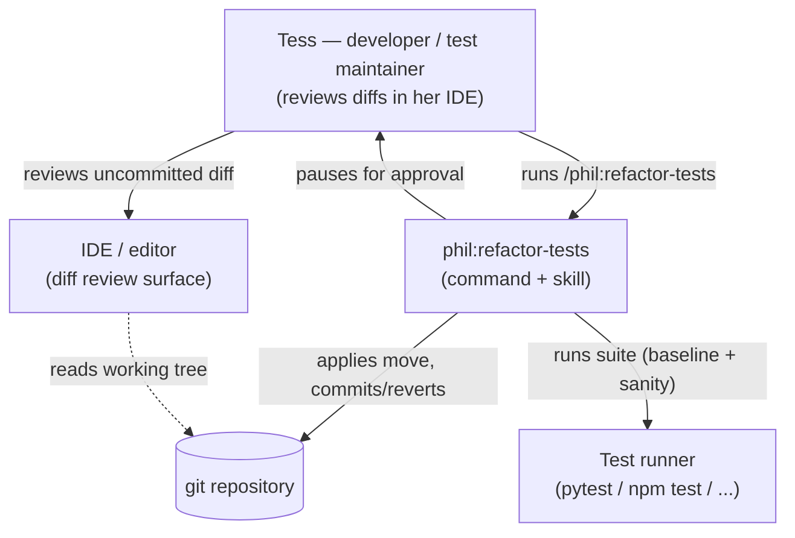
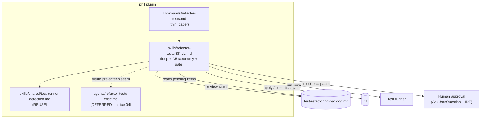

# Architecture Brief (SSOT)

Bootstrapped by DESIGN wave, feature: refactor-tests (2026-07-01).

## Application Architecture

Owner: Morgan (nw-solution-architect).

### refactor-tests

A new `/phil:refactor-tests` command + `skills/refactor-tests/SKILL.md` that cleans test code
to `testing.md` structure standards via a **human-approved, structure-only** refactoring loop.
It follows the plugin's established command→skill split and `phil:refactor`'s backlog loop,
but swaps the automated pass/fail gate for a human-approval interaction port: the tool applies
one proposed move to the working tree, runs the suite as a sanity check, and pauses for the
developer to review the uncommitted diff **in their IDE/editor** before it is committed or
reverted.

**Status:** IMPLEMENTED (2026-07-02) — shipped `commands/refactor-tests.md` +
`skills/refactor-tests/SKILL.md` (acceptance suite: `skills/refactor-tests/self-test/` +
`acceptance.feature`). Evolution: `docs/evolution/2026-07-02-refactor-tests.md`. The test-diff
critic remains deferred to slice 04 (the "future pre-screen seam" in the diagram below is accurate).

**Pattern:** modular prose skill, ports-and-adapters. Loop core = the skill; adapters = git,
filesystem, test runner (all via Bash), and the human-approval port (AskUserQuestion + editor
review). See feature-delta.md `DESIGN / [REF]` sections for the full decision record (DD1–DD8),
component decomposition, and Reuse Analysis.

**Safety oracle:** human approval per diff (DISCUSS D2). A green suite is only a secondary
sanity check; the automated test-diff critic is deferred (slice 04, ADR-002).

### C4: System Context

### C4: Container

### redesign-tests

A new `/phil:redesign-tests` command + `skills/redesign-tests/SKILL.md` — the behavior-CHANGING
sibling of `refactor-tests`. Same gated loop (never-on-red → propose → apply → suite sanity →
human gate → commit/revert → prune), but the allowed moves **deliberately change what tests
verify**: rewrite implementation-coupled / over-mocked / flaky assertions toward observable
behavior. Detection reuses `review-code`'s Priority 6 (Test Quality) taxonomy; the loop shape is
pattern-copied from `refactor-tests` (DESIGN Option A), not shared-module-extracted.

**Status:** DESIGNED (2026-07-06) — not yet implemented. DISCUSS + DESIGN complete;
`feature-delta.md` holds the full record.

**Pattern:** modular prose skill, ports-and-adapters (same as `refactor-tests`). Adapters = git,
filesystem, test runner (Bash), and the human-approval port.

**Safety oracle:** human approval per diff — the **sole** oracle (v1). Unlike `refactor-tests`, a
behavioral rewrite can change coverage, so the proposal carries a **coverage-equivalence claim**
(before/after "what it caught then / catches now") the human validates (ADR-004). An automated
coverage oracle (mutation / break-confirm) is deferred; the propose step reserves a pre-screen seam.

**Backlog:** `.test-redesign-backlog.md` — separate from `.test-refactoring-backlog.md` so the two
tools never collide.

See `docs/feature/redesign-tests/feature-delta.md` `DESIGN / [REF]` sections for DDD1–DDD9,
component decomposition, Reuse Analysis, and the C4 Container diagram.

### ADRs

- [ADR-001](adr-001-refactor-tests-reuse-boundaries.md) — refactor-tests: new command + reuse boundaries.
- [ADR-002](adr-002-human-approval-via-ide-diff.md) — refactor-tests: human-approval oracle via IDE diff review; critic deferred.
- [ADR-003](adr-003-redesign-tests-reuse-boundaries.md) — redesign-tests: new command + reuse boundaries (Option A).
- [ADR-004](adr-004-redesign-tests-coverage-equivalence-claim.md) — redesign-tests: coverage-equivalence claim at the human gate; automated oracle deferred.
