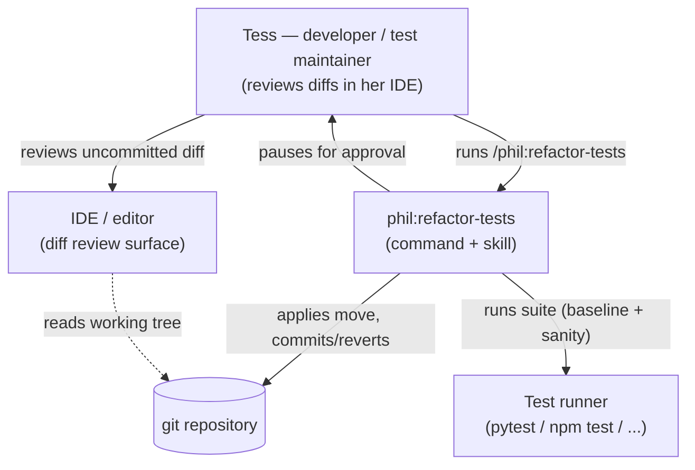
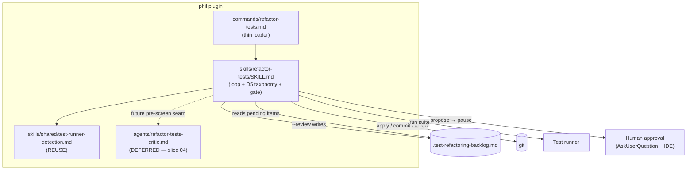

# Architecture Brief (SSOT)

Bootstrapped by DESIGN wave, feature: refactor-tests (2026-07-01).

## Application Architecture

Owner: Morgan (nw-solution-architect).

### refactor-tests

A new `/phil:refactor-tests` command + `skills/refactor-tests/SKILL.md` that cleans test code
to `testing.md` structure standards via a **human-approved, structure-only** refactoring loop.
It follows the plugin's established command→skill split and `phil:refactor`'s backlog loop,
but swaps the automated pass/fail gate for a human-approval interaction port: the tool applies
one proposed move to the working tree, runs the suite as a sanity check, and pauses for the
developer to review the uncommitted diff **in their IDE/editor** before it is committed or
reverted.

**Pattern:** modular prose skill, ports-and-adapters. Loop core = the skill; adapters = git,
filesystem, test runner (all via Bash), and the human-approval port (AskUserQuestion + editor
review). See feature-delta.md `DESIGN / [REF]` sections for the full decision record (DD1–DD8),
component decomposition, and Reuse Analysis.

**Safety oracle:** human approval per diff (DISCUSS D2). A green suite is only a secondary
sanity check; the automated test-diff critic is deferred (slice 04, ADR-002).

### C4: System Context

### C4: Container

### ADRs

- [ADR-001](adr-001-refactor-tests-reuse-boundaries.md) — new command + reuse boundaries.
- [ADR-002](adr-002-human-approval-via-ide-diff.md) — human-approval oracle via IDE diff review; critic deferred.
