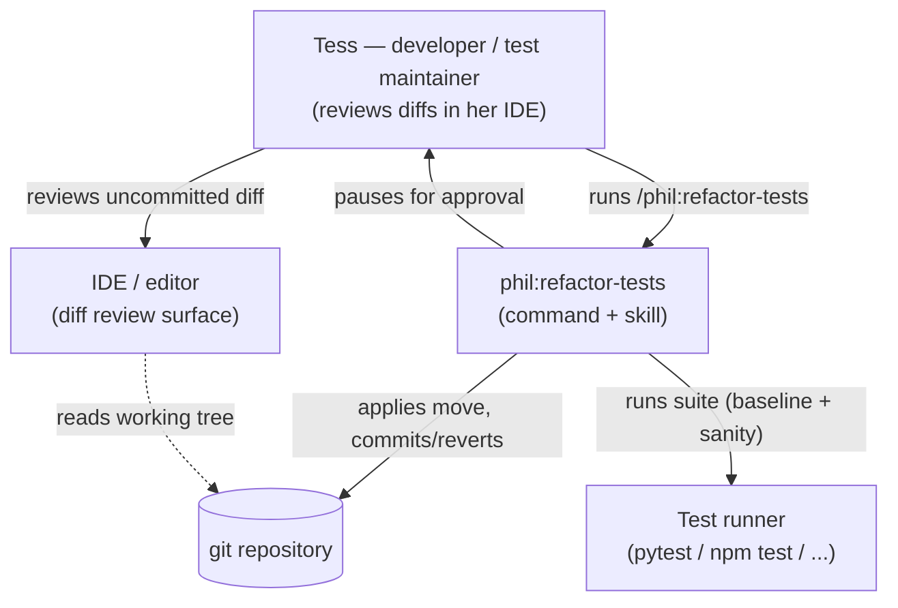
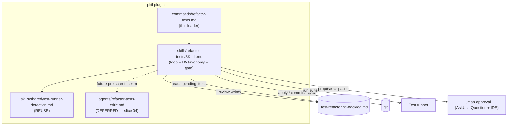
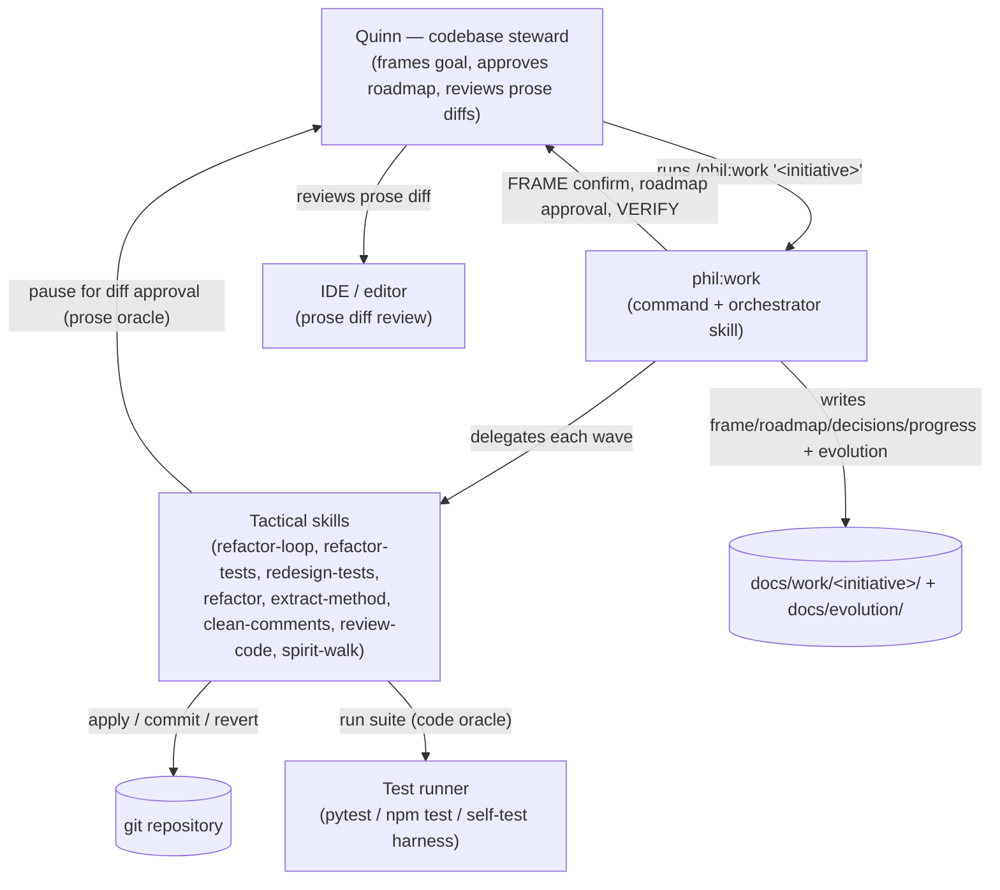
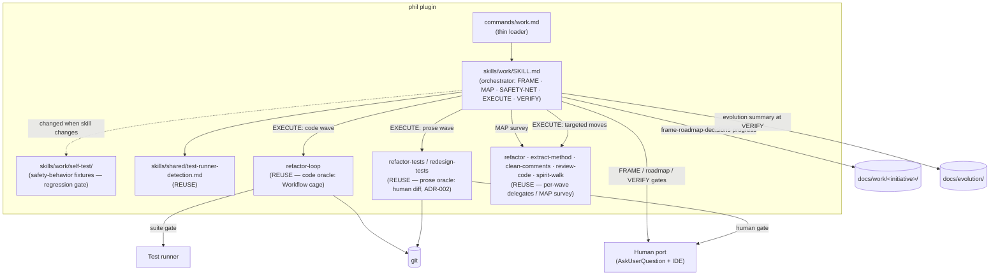
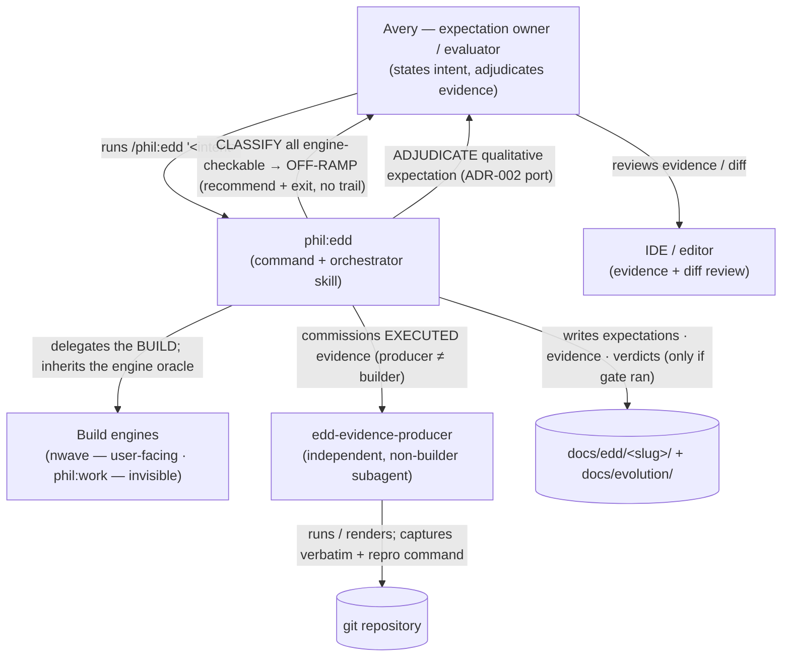
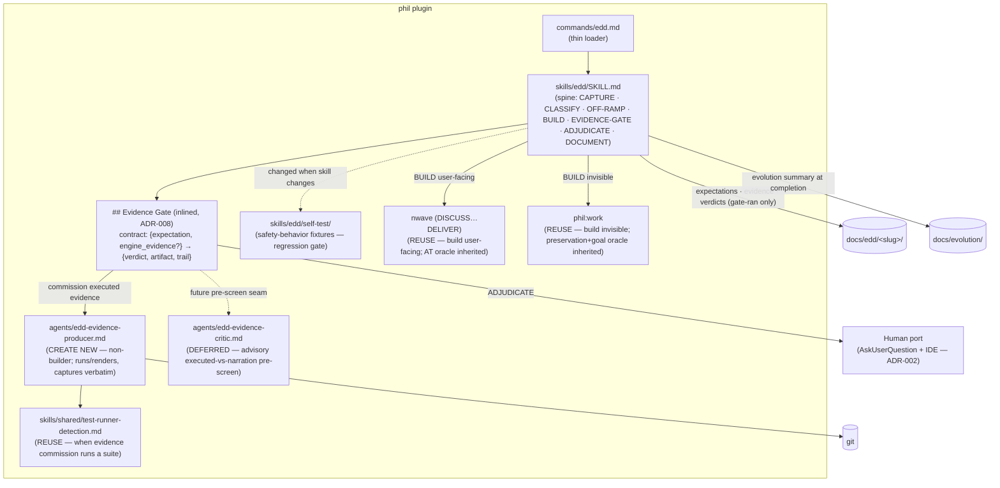
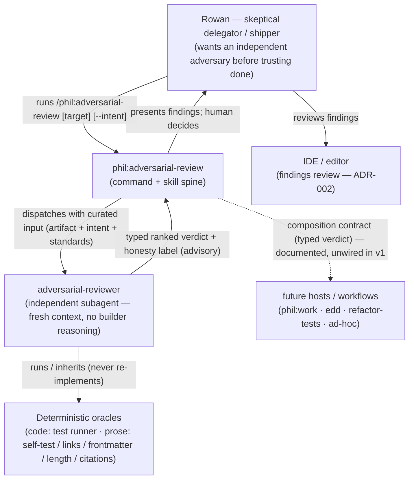
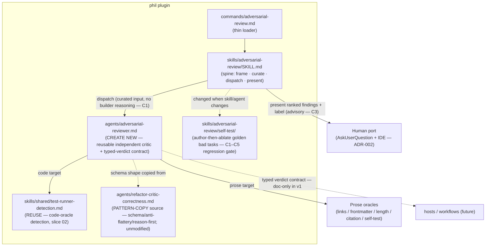

# Architecture Brief (SSOT)

Bootstrapped by DESIGN wave, feature: refactor-tests (2026-07-01).

## Application Architecture

Owner: Morgan (nw-solution-architect).

### refactor-tests

A new `/phil:refactor-tests` command + `skills/refactor-tests/SKILL.md` that cleans test code
to `testing.md` structure standards via a **human-approved, structure-only** refactoring loop.
It follows the plugin's established command→skill split and `phil:refactor`'s backlog loop,
but swaps the automated pass/fail gate for a human-approval interaction port: the tool applies
one proposed move to the working tree, runs the suite as a sanity check, and pauses for the
developer to review the uncommitted diff **in their IDE/editor** before it is committed or
reverted.

**Status:** IMPLEMENTED (2026-07-02) — shipped `commands/refactor-tests.md` +
`skills/refactor-tests/SKILL.md` (acceptance suite: `skills/refactor-tests/self-test/` +
`acceptance.feature`). Evolution: `docs/evolution/2026-07-02-refactor-tests.md`. The test-diff
critic remains deferred to slice 04 (the "future pre-screen seam" in the diagram below is accurate).

**Pattern:** modular prose skill, ports-and-adapters. Loop core = the skill; adapters = git,
filesystem, test runner (all via Bash), and the human-approval port (AskUserQuestion + editor
review). See feature-delta.md `DESIGN / [REF]` sections for the full decision record (DD1–DD8),
component decomposition, and Reuse Analysis.

**Safety oracle:** human approval per diff (DISCUSS D2). A green suite is only a secondary
sanity check; the automated test-diff critic is deferred (slice 04, ADR-002).

### C4: System Context

### C4: Container

### redesign-tests

A new `/phil:redesign-tests` command + `skills/redesign-tests/SKILL.md` — the behavior-CHANGING
sibling of `refactor-tests`. Same gated loop (never-on-red → propose → apply → suite sanity →
human gate → commit/revert → prune), but the allowed moves **deliberately change what tests
verify**: rewrite implementation-coupled / over-mocked / flaky assertions toward observable
behavior. Detection reuses `review-code`'s Priority 6 (Test Quality) taxonomy; the loop shape is
pattern-copied from `refactor-tests` (DESIGN Option A), not shared-module-extracted.

**Status:** DESIGNED (2026-07-06) — not yet implemented. DISCUSS + DESIGN complete;
`feature-delta.md` holds the full record.

**Pattern:** modular prose skill, ports-and-adapters (same as `refactor-tests`). Adapters = git,
filesystem, test runner (Bash), and the human-approval port.

**Safety oracle:** human approval per diff — the **sole** oracle (v1). Unlike `refactor-tests`, a
behavioral rewrite can change coverage, so the proposal carries a **coverage-equivalence claim**
(before/after "what it caught then / catches now") the human validates (ADR-004). An automated
coverage oracle (mutation / break-confirm) is deferred; the propose step reserves a pre-screen seam.

**Backlog:** `.test-redesign-backlog.md` — separate from `.test-refactoring-backlog.md` so the two
tools never collide.

See `docs/feature/redesign-tests/feature-delta.md` `DESIGN / [REF]` sections for DDD1–DDD9,
component decomposition, Reuse Analysis, and the C4 Container diagram.

### phil-work

A new `/phil:work` command + `skills/work/SKILL.md` — a **wave-based orchestrator** for invisible
(non-user-facing) technical initiatives: refactoring, re-architecting, cleanup, migrations,
dependency/perf work. It is the invisible-work sibling to nwave. It follows the plugin's
command→skill split and ports-and-adapters pattern, but its distinguishing move is that it is a
**general contractor**: it discusses, plans, and sequences waves, then **delegates execution to
the tactical skills already in the plugin**, inheriting each delegate's gate rather than building
its own.

**Status:** IMPLEMENTED (2026-07-13) — shipped `commands/work.md` + `skills/work/SKILL.md` across
5 thin slices (walking skeleton first). Acceptance suite: `skills/work/self-test/` (7 fixtures) +
`skills/work/acceptance.feature`. Evolution: `docs/evolution/2026-07-13-phil-work.md`. `feature-delta.md`
holds the full DISCUSS+DESIGN+DISTILL record; DELIVER progress in `docs/feature/phil-work/deliver/`.
One v1 boundary (UI-1): non-test prose uses the ADR-002 human-approval gate directly (no dedicated
non-test-prose delegate yet).

**Pattern:** modular prose skill, ports-and-adapters. **Substrate (ADR-005):** hybrid — a prose
spine (`skills/work/SKILL.md`) owns the interactive, non-safety-critical flow (FRAME → MAP →
SAFETY-NET setup → sequencing → VERIFY → decision trail); each EXECUTE wave delegates to the
tactical skill that already owns the correct gate.

**Verification spine (DISCUSS D4/D9):** preservation floor (always) + declared initiative goal
(per initiative). The preservation oracle is **artifact-aware and inherited from the delegate** —
code → `refactor-loop`'s deterministic Workflow cage; prose (skills/rules/agents) →
`refactor-tests`/`redesign-tests` human-approval diff (ADR-002). `/phil:work` adds only the
cross-wave sequencing gate: any delegate failure stops the sequence and leaves the tree last-good.

**Documentation trail (ADR-006):** working trail under `docs/work/<initiative>/`
(frame, roadmap, decisions, progress); durable evolution summary migrates to
`docs/evolution/<date>-<initiative>.md`.

#### C4: System Context

#### C4: Container

### edd-loop

A new `/phil:edd` command + `skills/edd/SKILL.md` — the **expectation-driven sibling to
`phil:work`**. Where `phil:work` is the general contractor for *invisible* work (preserve behavior +
hit a checkable goal), `phil:edd` is the contractor for *expectation-driven* work: it captures a
developer's intent as discrete **expectations**, classifies each, and — biased toward getting out of
the way — **off-ramps** to nwave (user-facing) or `phil:work` (invisible) whenever those engines'
native oracles already prove the intent. Only for the **qualitative residue** (expectations no test
can cheaply assert — "errors are helpful", "the API feels ergonomic") does it delegate the build to
one engine and attach a **scaled executed-evidence gate** the developer adjudicates.

**Status:** IMPLEMENTED (2026-07-15) — shipped `commands/edd.md` + `skills/edd/SKILL.md` +
`agents/edd-evidence-producer.md` across 2 slices (walking-skeleton off-ramp → evidence gate +
producer). Acceptance suite: `skills/edd/self-test/` (7 fixtures) + `skills/edd/acceptance.feature`.
Evolution: `docs/evolution/2026-07-15-edd-loop.md`. `docs/feature/edd-loop/feature-delta.md` holds the
full DISCUSS+DESIGN+DISTILL record; DELIVER progress in `docs/feature/edd-loop/deliver/`. v1 = slices
01–02 (triage + off-ramp; single-engine qualitative gate). Cross-domain multi-initiative sequencing +
seam-level expectations deferred to slice 03.

**Pattern:** modular prose skill, ports-and-adapters (same lineage as `phil:work`).
**Substrate (ADR-007):** prose spine (`skills/edd/SKILL.md`) owns the interactive flow
(CAPTURE → CLASSIFY → OFF-RAMP | BUILD → EVIDENCE-GATE → ADJUDICATE → DOCUMENT); the **build** is
delegated to nwave / `phil:work` and their oracle is **inherited** (never re-verified — ADR-005
lineage); **separation of powers** is structural — a dedicated non-builder **evidence-producer
subagent** runs/renders and captures the artifact verbatim, and the **human adjudicates** via the
ADR-002 port.

**Gate factoring (ADR-008):** the qualitative-evidence gate is **inlined** in `skills/edd/SKILL.md`
with a defined input/output contract and an extraction seam — NOT extracted to a shared skill in v1
(one consumer today), and `phil:work`/nwave are composed **unchanged**.

**Evidence contract (DISCUSS D2):** evidence must be a raw artifact from an actual run/render,
captured verbatim + the command that reproduces it; narration (a description/claim without a
reproducible artifact) is rejected and re-commissioned.

**Documentation trail (ADR-009):** `docs/edd/<slug>/` (expectations · evidence/ · verdicts) —
written **only when the gate ran** (off-ramp-only runs leave no trail); durable summary migrates to
`docs/evolution/<date>-<slug>.md`.

#### C4: System Context

#### C4: Container

### adversarial-review

A new `/phil:adversarial-review` command + `skills/adversarial-review/SKILL.md` + a reusable
`agents/adversarial-reviewer.md` — a **general-purpose independent critic**. Point it at a completed
task and it returns ranked, evidence-bearing findings that try to **falsify "done"**. It is the
sibling to `phil:edd`: edd *produces executed evidence for a human to judge*; adversarial-review
*does the judging* — an independent adversary that attacks the output and returns a typed, advisory
verdict. It generalizes `refactor-critic-correctness` out from behind its test-suite oracle.

**Status:** DESIGNED (2026-07-15) — DISCUSS + DESIGN complete; not yet implemented.
`docs/feature/adversarial-review/feature-delta.md` holds the full record; slice briefs 01–02 in
`docs/feature/adversarial-review/slices/`.

**Pattern:** modular prose skill, ports-and-adapters (same lineage as edd / phil-work).
**Substrate (ADR-010):** prose spine (`skills/adversarial-review/SKILL.md`) drives a **Task-dispatched
reviewer subagent**; the **agent is the reusable unit** (invoked by the standalone skill and — later,
unwired in v1 — by hosts/workflows), and the **typed verdict is the composition contract**. Advisory
only — the reviewer **never self-adjudicates** (C3); the host or human owns any gate.

**The anti-theatre spine (ADR-011):** every review **splits findings hard-checkable vs soft** (C2)
and carries a mechanical **honesty label** — `sound-gate` iff ≥1 deterministic oracle backs it, else
`draft-signal` (C4). "Hard oracle" is generalized to **prose oracles** (self-test pass, dead-link /
broken-ref, frontmatter validity, file-length, required-citation) — not just a test suite — because
the plugin's targets are usually prose. Independence (C1): fresh-context subagent, builder reasoning
withheld. Anti-flattery (C5): no finding without a span; empty praise → `CANNOT_ASSESS`.

**v1 scope:** standalone only; **edits no existing skill** (composition is a documented contract, not
wiring — hosts adopt later per ADR-008's second-consumer rule). Accepted v1 risk: same-model
fresh-context reviewer isn't *full* independence; different-model / multi-lens-panel hardening is a
recorded extension seam.

#### C4: System Context

#### C4: Container

### ADRs

- [ADR-001](adr-001-refactor-tests-reuse-boundaries.md) — refactor-tests: new command + reuse boundaries.
- [ADR-002](adr-002-human-approval-via-ide-diff.md) — refactor-tests: human-approval oracle via IDE diff review; critic deferred.
- [ADR-003](adr-003-redesign-tests-reuse-boundaries.md) — redesign-tests: new command + reuse boundaries (Option A).
- [ADR-004](adr-004-redesign-tests-coverage-equivalence-claim.md) — redesign-tests: coverage-equivalence claim at the human gate; automated oracle deferred.
- [ADR-005](adr-005-phil-work-hybrid-substrate-delegated-gates.md) — phil-work: hybrid substrate (prose spine + delegate-owned gates); no re-implemented gating.
- [ADR-006](adr-006-phil-work-documentation-namespace.md) — phil-work: `docs/work/<initiative>/` trail + evolution summary to `docs/evolution/`.
- [ADR-007](adr-007-edd-loop-substrate-delegated-build-evidence-producer.md) — edd-loop: prose spine + delegated build + inherited oracle; separation of powers via a non-builder evidence-producer subagent; human adjudicates.
- [ADR-008](adr-008-edd-loop-evidence-gate-factoring.md) — edd-loop: qualitative-evidence gate inlined with an extraction seam (not a shared skill in v1); engines composed unchanged.
- [ADR-009](adr-009-edd-loop-documentation-namespace.md) — edd-loop: `docs/edd/<slug>/` trail (gate-ran only) + evolution summary to `docs/evolution/`.
- [ADR-010](adr-010-adversarial-review-substrate-agent-as-reusable-unit.md) — adversarial-review: prose spine + agent-as-reusable-unit; standalone-only v1, composition documented not wired.
- [ADR-011](adr-011-adversarial-review-hard-soft-oracle-honesty-label.md) — adversarial-review: hard/soft split generalized to prose oracles; mechanical `sound-gate`/`draft-signal` honesty label.
